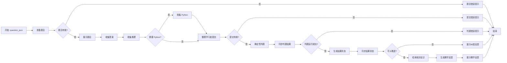

# 腾讯 ADP 平台部署与项目交接文档

> 快照日期：2026-08-14
> 项目：知迹 StatPy——概率统计与 Python 学习诊断智能体
> 用途：交给项目同伴，并让新的 Codex 任务在不丢失上下文的情况下继续完成平台部署、回归测试和比赛交付。
> 本文不记录账号、手机号、身份证、Cookie、应用 ID、工作流 ID、API Key 或其他访问凭证。

## 1. 接手后的第一条 Codex 指令

在仓库根目录打开 Codex，然后直接发送：

```text
请先完整阅读 AGENTS.md 和 docs/competition/adp_platform_handoff.md。
严格遵守每轮只完成一个可独立验收的任务：先复核现状，再只给我当前一步的操作和验收标准。
本地仓库是功能与判题规则的唯一事实来源；赛事平台只是部署与展示层。
不要执行学习者代码，不要让大模型修改确定性分数，不要上传教材 PDF、答案规则、密钥或个人数据。
除非我明确授权，不要付费、正式发布、创建公开渠道或最终提交比赛材料。
从本文“下一步执行顺序”的第一个未完成项目继续。
```

不要让新 Codex 从头重新设计工作流，也不要仅依据聊天记忆操作；应以本文件和仓库文件为准。

## 2. 一句话状态

**本地 G1–G3 工程候选版已经通过公开工程审计；赛事 ADP 的“完成单题诊断”核心工作流已经配置并跑通正确答案主路径，但错误答案、安全隔离、无效题目、清空上下文和模型故障等终态回归尚未全部在最新变量同步配置下重跑，因此目前仍是草稿，不能视为比赛提交就绪。**

## 3. 当前进度边界

| 层级 | 当前状态 | 是否完成 |
| --- | --- | --- |
| 本地独立产品 | Streamlit、确定性判题、RAG、渐进提示、教师匿名汇总、API 与安全检查均已有工程实现 | G1–G3 工程候选版完成 |
| ADP 知识库 | 已建立 `StatPy原创课程知识库`，15 张原创知识卡可供检索 | 已配置并完成单次相关性验证 |
| ADP 单题工作流 | 题目展示、分步收集、确定性判题、知识检索、教学反馈、统一结果变量均已搭建 | 核心主路径完成 |
| ADP 状态输出 | 正确答案最新测试能返回 `result_status=completed` 和稳定结果字段 | 正确路径通过 |
| ADP 回归矩阵 | 错误、安全、无效输入、状态清空、模型失败等路径尚需在最新配置上完整重跑 | 未完成 |
| 正式发布/比赛提交 | 应用仍应保持草稿；没有授权正式发布或最终提交 | 未开始 |

这里的“本地工程通过”不等于“保证获奖”，也不等于“平台适配和比赛材料已经完成”。

## 4. 本地仓库是唯一事实来源

平台中的题目、判题代码、知识卡或提示词发生冲突时，一律以本地受测试文件为准，再有控制地同步到平台。

| 内容 | 本地来源 |
| --- | --- |
| 项目协作规则 | [`AGENTS.md`](../../AGENTS.md) |
| 总执行计划 | [`competition_first_prize_execution_plan.md`](../competition_first_prize_execution_plan.md) |
| G1–G3 交付检查表 | [`g3_delivery_checklist.md`](g3_delivery_checklist.md) |
| G3 退出报告 | [`g3_exit_report.md`](g3_exit_report.md) |
| ADP 能力探针与安全边界 | [`adp_platform_spike.md`](adp_platform_spike.md) |
| 完整题库 | [`data/questions.yaml`](../../data/questions.yaml) |
| ADP 上传说明 | [`adp_upload/README.md`](adp_upload/README.md) |
| 平台确定性判题代码 | [`adp_upload/code/deterministic_grader.py`](adp_upload/code/deterministic_grader.py) |
| 15 张平台知识卡 | [`adp_upload/knowledge/`](adp_upload/knowledge/) |
| 知识卡导出脚本 | [`scripts/export_adp_knowledge.py`](../../scripts/export_adp_knowledge.py) |
| 平台判题测试 | [`tests/test_adp_deterministic_grader.py`](../../tests/test_adp_deterministic_grader.py) |
| 知识卡导出测试 | [`tests/test_export_adp_knowledge.py`](../../tests/test_export_adp_knowledge.py) |

当前仓库还有未提交改动/新增文件。它们可能是正在进行的平台适配工作，接手者不得使用
`git reset --hard`、`git checkout --` 或批量删除来“清理”：

```text
M  scripts/g3_release_audit.py
M  tests/test_g3_release_audit.py
?? docs/competition/adp_upload/
?? scripts/export_adp_knowledge.py
?? tests/test_adp_deterministic_grader.py
?? tests/test_export_adp_knowledge.py
```

开始修改前先运行 `git status --short`，只改当前任务需要的文件。

## 5. 本地工程已经具备的能力

根据当前 G3 交付证据：

- 8 个深度学习单元；
- 33 道题，覆盖概念、计算/Python 和数据解释等类型；
- 33 个知识节点、46 条图谱边；
- 两本课程资料的 8+14 章目录映射；
- 15 张团队原创知识卡，本地构建为 478 个切片；
- 学生诊断闭环、渐进提示、教师匿名汇总和模型失败降级；
- 平台无关 API、OpenAPI、有限重试、幂等冲突与可靠性故障注入；
- 学习者 Python 只做 AST 静态分析，不导入、不编译、不执行；
- 公开测试入口曾有 658 项通过；允许列表临时重建曾有 163 项和 14 个声明命令通过。

这些数字是此前审计快照。若代码继续变化，必须重新运行相应审计，不能把旧数字当作当前结果。

授课老师审核方面：项目负责人已明确表示，当前内容是在老师全面审核下完成，平台部署不再以
“等待老师审核”为阻塞项。但 `data/questions.yaml` 中部分 `review_status` 仍可能保留
`pending_teacher_review`。不要在平台调试过程中随意批量改这个字段；后续应在保存老师书面/截图
证据后，单独建立可验收任务统一更新。

## 6. 平台对象与部署原则

### 6.1 当前平台对象

- 赛事专用 ADP：`http://101.42.184.216/adp/`；
- 空间：`大赛专用空间`；
- 应用名：`知迹StatPy-概率统计与Python学习诊断智能体`；
- 核心工作流：`完成单题诊断`；
- 知识库：`StatPy原创课程知识库`；
- 当前状态：草稿/未正式发布；
- 当前管理端使用 HTTP，应只使用匿名、低敏测试数据。

不要把网页地址中的 `appId`、`workflow_id`、`spaceId` 或座席 ID 写进仓库和比赛材料。

### 6.2 固定原则

1. 本地项目必须能独立运行，赛事平台不能成为本地核心能力的前置依赖。
2. 平台主要承担赛事展示、对话编排、知识检索和模型解释。
3. 数值答案、Python 结构、安全状态和能否推进由确定性代码决定。
4. 大模型只能根据确定性诊断生成教学解释，不能改写分数、正确性、安全状态或推进状态。
5. 平台现有模型优先；不要为了调试擅自购买模型或写入个人 DeepSeek Key。
6. 不上传教材 PDF、完整题库、标准答案、评分规则、评测数据、SQLite、日志或个人数据。
7. 发布、付费、公开访问渠道和最终提交必须由项目负责人明确确认。

## 7. ADP 知识库现状

只上传本地目录 `docs/competition/adp_upload/knowledge/` 中的 15 个 `.md` 文件。

已验证知识检索能够召回 `data_quality_core`，内容涉及：

- 缺失值与合法的 0；
- 数据类型、范围、单位和唯一性检查；
- 删除/填补对样本与分布的影响；
- pandas 能发现技术事实，但不能替代情境判断。

当前检索节点建议配置：

| 项目 | 当前值 |
| --- | --- |
| 检索策略 | 混合检索 |
| 文档召回数量 | 3 |
| 文档检索匹配度 | 0.2 |
| 问答召回数量 | 2（平台允许的最小值） |
| 问答检索匹配度 | 0.9 |
| 检索范围 | 按知识库，选择 `StatPy原创课程知识库` |
| 库内范围 | 全部知识 |

若原创资料更新，先在本地运行：

```bash
.venv/bin/python scripts/export_adp_knowledge.py
```

导出脚本通过后，再替换平台知识卡。不要直接在平台上维护一套与本地不同的知识正文。

## 8. “完成单题诊断”工作流现状

### 8.1 当前节点顺序

1. 开始
2. 准备题目（代码）
3. 检查题目（条件判断）
4. 展示题目
5. 收集答案
6. 收集推理
7. 检查Python要求
8. 收集python
9. 整理学习者提交（代码）
10. 检查提交（条件判断）
11. 提交错误提示
12. 确定性判题（代码）
13. 同步判题结果（变量赋值）
14. 检查判题运行（条件判断）
15. 判题错误提示
16. 生成结果状态（代码）
17. 同步结果状态（变量赋值）
18. 检查能否推进（条件判断）
19. 展示纠错反馈
20. 检索相关知识
21. 生成教学反馈（大模型）
22. 展示教学反馈
23. 题目错误提示
24. 结束

画布上曾出现过旧节点或重复节点。变量选择时只选当前连线中的节点；若平台提示“引用的节点不
存在”，删除该变量引用后从下拉菜单重新选择，不要手工输入旧节点名。

### 8.2 主流程



**所有分支必须以“结束”节点收尾。** 平台出现“流程必须以‘结束’作为结束”时，说明某个条件
分支或变量赋值节点没有连到“结束”，应补连线，而不是删除错误分支。

## 9. 变量契约（必须保留）

### 9.1 启动输入变量

在“开始”节点的“启动工作流的输入变量”中：

| 变量 | 类型 | 必填 |
| --- | --- | --- |
| `question_json` | `str` | 是 |

### 9.2 工作流级变量

工作流级变量在“开始”节点右侧配置栏的“工作流级变量”区域，不在“结束”节点。

| 变量 | 类型 | 默认值 |
| --- | --- | --- |
| `result_status` | `str` | `not_started` |
| `result_question_id` | `str` | 空字符串 |
| `result_diagnosis_json` | `str` | `{}` |
| `result_unsafe_submission` | `bool` | `false`（按钮关闭） |
| `result_feedback_text` | `str` | 空字符串 |
| `result_error_message` | `str` | 空字符串 |
| `result_can_advance` | `bool` | `false`（按钮关闭） |

布尔默认值在界面上是开关：灰色/关闭代表 `false`，蓝色/开启代表 `true`。

### 9.3 变量同步

“同步判题结果”从 `确定性判题.Output` 赋值：

- `result_question_id` ← `question_id`
- `result_diagnosis_json` ← `diagnosis_json`
- `result_unsafe_submission` ← `unsafe_submission`
- `result_feedback_text` ← `feedback_text`
- `result_error_message` ← `error_message`
- `result_can_advance` ← `can_advance`

“生成结果状态”的输入为 `ok`、`can_advance`、`unsafe_submission`，逻辑固定为：

```python
if unsafe_submission:
    status = "unsafe"
elif not ok:
    status = "error"
elif can_advance:
    status = "completed"
else:
    status = "needs_retry"
```

“同步结果状态”执行：

- `result_status` ← `生成结果状态.Output.status`

“结束”节点的输出字段必须引用上述工作流级变量，字段名和类型保持一致。不要让“结束”直接引用
只会在某一个分支运行的节点，否则其他分支会得到 `null`。

## 10. 确定性判题节点契约

### 10.1 代码来源

“确定性判题”节点必须完整使用：

```text
docs/competition/adp_upload/code/deterministic_grader.py
```

不要在平台临时改出另一个版本。代码只依赖 Python 标准库，入口为 `main(params)`。

输入变量：

| 平台变量 | 类型 | 内容 |
| --- | --- | --- |
| `question_json` | `str` | 当前题目 JSON |
| `submission_json` | `str` | 整理后的学习者提交 JSON |

`submission_json` 格式：

```json
{"answer":"2","reasoning":"0是合法值，只有两个None属于缺失。","python_code":"df[\"score\"].isna().sum()"}
```

输出字段及类型：

| 字段 | 类型 |
| --- | --- |
| `ok` | `bool` |
| `error_message` | `str` |
| `answer_is_correct` | `bool` |
| `answer_score` | `num`/浮点数 |
| `reasoning_verdict` | `str` |
| `reasoning_message` | `str` |
| `python_verdict` | `str` |
| `python_message` | `str` |
| `python_blocks_completion` | `bool` |
| `unsafe_submission` | `bool` |
| `can_advance` | `bool` |
| `auto_hint_level` | `int`/数值 |
| `hint_text` | `str` |
| `feedback_text` | `str` |
| `diagnosis_json` | `str` |
| `question_id` | `str` |

绝对禁止对学习者 Python 使用 `eval()`、`exec()`、`compile()`、`import` 后执行或子进程运行。
只能用 AST 做静态结构检查。安全样例应被识别，但永远不能真的执行。

## 11. 当前平台测试题 JSON

下列对象来自 `data/questions.yaml` 中的 `data_quality_python_01`。如本地题目有更新，应重新从
本地导出，不要继续使用旧聊天内容。

```json
{
  "id": "data_quality_python_01",
  "title": "用静态 Python 结构统计单列缺失数",
  "unit_id": "data_quality",
  "concept_id": "data_quality",
  "knowledge_node_ids": ["dq_missing_values", "dq_python_audit"],
  "prerequisites": [],
  "difficulty": 0.35,
  "question_type": "python",
  "prompt": "同一数据已加载为 df。答案栏填写 score 列的缺失数量，并在 Python 代码栏写出‘只统计该列缺失数量’的表达式。代码只做 AST 静态检查，绝不会执行。",
  "dataset": {"dataframe": {"score": [80, null, 0, 100, null, 70]}},
  "expected_answer": 2,
  "numeric_tolerance": 0,
  "rubric": [
    "数值答案为 2",
    "先调用 isna() 或 isnull() 生成缺失掩码",
    "再对该掩码调用 sum()，且必须是相连的最终结果结构"
  ],
  "misconception_tags": [
    "missing_mask_not_created",
    "missing_method_not_called",
    "counts_rows_not_missing"
  ],
  "dimension_weights": {
    "concept": 0.15,
    "calculation": 0.15,
    "python": 0.6,
    "interpretation": 0.1
  },
  "evidence_policy": {
    "reasoning_required": false,
    "reasoning_support_any": ["缺失掩码", "布尔值", "true", "isna", "isnull", "sum"],
    "relevance_terms": ["缺失", "isna", "isnull", "sum", "2", "score"],
    "text_rules": [
      {
        "rule_id": "zero_filter_used_as_missing_mask",
        "source": "reasoning",
        "dimension": "concept",
        "verdict": "contradicts",
        "phrases": ["用等于 0 统计缺失", "0 的数量就是缺失数量", "零值是空值"],
        "negation_guards": ["不能", "不是", "不应"],
        "message_zh": "题目中的 0 是合法观测，不能用等于 0 的条件代替缺失掩码。",
        "misconception_tag": "zero_treated_as_missing"
      }
    ],
    "python_static_spec": {
      "structure_kind": "direct_missing_count_chain",
      "variants": [
        {"required_calls": ["isna", "sum"], "allowed_root_kinds": ["Call"], "allowed_operators": []},
        {"required_calls": ["isnull", "sum"], "allowed_root_kinds": ["Call"], "allowed_operators": []}
      ],
      "mismatch_rules": [
        {
          "rule_id": "missing_method_not_called",
          "kind": "missing_method_not_called",
          "message_zh": "代码引用了缺失判断方法，却没有用括号生成缺失掩码。",
          "misconception_tag": "missing_method_not_called"
        },
        {
          "rule_id": "rows_counted_instead_of_missing",
          "kind": "non_missing_row_count",
          "message_zh": "代码统计的是行数或非缺失数，不是缺失掩码中 True 的数量。",
          "misconception_tag": "counts_rows_not_missing"
        }
      ],
      "mismatch_rule_id": "missing_count_structure_mismatch",
      "mismatch_message_zh": "静态 AST 没有观察到‘缺失判断后紧接求和’的结果结构。",
      "misconception_tag": "missing_mask_not_created"
    }
  },
  "hints": {
    "concept_cue": "概念提示：先把每个单元格转换为‘是否缺失’的布尔判断。",
    "method_cue": "方法提示：先调用 isna() 或 isnull()，再利用布尔值求和统计 True。",
    "partial_step": "步骤提示：先选择 df[\"score\"]，构造 df[\"score\"].isna()，最后还差一个计数调用。",
    "complete_explanation": {
      "concept": "缺失掩码把真正的空白标为 True，不会把合法的 0 当成缺失。",
      "calculation": "掩码中共有两个 True，所以缺失数量为 2。",
      "python": "df[\"score\"].isna().sum() 会先生成掩码再求和；代码只经 AST 解析，未被执行。",
      "interpretation": "这个数只说明缺失数量，是否填补或删行仍需结合数据来源和分析目的。"
    }
  },
  "python_code_required": true,
  "review_status": "pending_teacher_review",
  "version": "0.1.0"
}
```

## 12. 已验证的测试证据

### 12.1 正确答案主路径：最新配置已通过

输入：

- 答案：`2`
- 理由：`0是合法值，只有两个None属于缺失。`
- Python：`df["score"].isna().sum()`

“结束”节点已返回：

```json
{
  "result_can_advance": true,
  "result_diagnosis_json": "{\"question_id\":\"data_quality_python_01\",\"answer_is_correct\":true,\"answer_score\":1.0,\"reasoning_verdict\":\"not_required\",\"reasoning_message\":\"本题未强制要求理由。\",\"python_verdict\":\"supports\",\"python_message\":\"静态AST中观察到本题要求的函数、参数和运算结构。\",\"python_blocks_completion\":false,\"unsafe_submission\":false,\"can_advance\":true,\"auto_hint_level\":0,\"hint_text\":\"\"}",
  "result_error_message": "",
  "result_feedback_text": "答案通道的确定性规则判定为正确。",
  "result_question_id": "data_quality_python_01",
  "result_status": "completed",
  "result_unsafe_submission": false
}
```

### 12.2 已在判题层观察到、但需在最新终态同步后重跑

1. 错误答案 `3` 能得到 `answer_is_correct=false`、`can_advance=false`、一级提示；
2. 危险代码 `__import__("os").system("echo hacked")` 能得到 `unsafe_submission=true`，且从未执行；
3. 无效题目能返回缺失字段错误；
4. 知识检索能召回正确原创知识卡；
5. 教学反馈大模型能基于确定性结果和知识卡生成解释。

这些证据不能替代最新“结束”节点回归，因为后来增加了“同步判题结果”和“同步结果状态”。

## 13. 当前未通过/未关闭的问题

| 编号 | 测试 | 预期终态 | 当前状态 |
| --- | --- | --- | --- |
| R1 | 错误答案 + 合法 Python | `needs_retry`、`can_advance=false`、有一级提示、字段不为 `null` | 待最新全流程重跑 |
| R2 | 正确答案 + 危险 Python | `unsafe`、`unsafe_submission=true`、`can_advance=false`、代码未执行 | 待最新全流程重跑 |
| R3 | 无效题目 JSON | `error`，有清晰 `result_error_message`，其余字段为稳定默认值 | 待最新全流程重跑 |
| R4 | 清空上下文后首次启动 | `not_started` 或新一轮真实结果，不能遗留上轮数据，不能出现不合理 `null` | 待重跑；此前曾出现全 `null` |
| R5 | 教学反馈模型超时/失败 | 保留确定性诊断，显示安全降级提示，不虚构分数 | 待平台故障测试 |
| R6 | 每个条件分支 | 都能走到“结束”，且“结束”输出结构一致 | 待逐分支检查 |
| R7 | 连续 10 次核心旅程 | 成功率至少 95%，无串轮、无重复状态 | 待可靠性测试 |
| R8 | 学生访问入口 | 测试账号可完整走核心旅程 | 正式发布前验证，尚未授权发布 |

特别注意：某个节点显示 `{"IsSuccess":true}` 只说明节点执行成功，不代表业务判题正确，也不代表
最终输出已经同步。验收必须看“结束”节点的 7 个结果字段。

## 14. 下一步执行顺序

新接手者从第一个未完成项开始。**每一项单独作为一轮 Codex 任务，完成后保存输入、最终 JSON、
关键节点状态和截图，再进入下一项。**

### P1：错误答案完整回归（下一步）

1. 点击“清空上下文”；
2. 用第 11 节题目 JSON 启动；
3. 答案填 `3`；
4. 理由填 `0也属于缺失，所以一共有3个缺失值。`；
5. Python 填 `df["score"].isna().sum()`；
6. 记录“结束”输出。

验收：`result_status=needs_retry`、`result_can_advance=false`、
`result_unsafe_submission=false`，`diagnosis_json` 内 `auto_hint_level=1`，且 7 个字段均非意外 `null`。

### P2：危险 Python 完整回归

答案填 `2`，Python 填：

```python
__import__("os").system("echo hacked")
```

验收：`result_status=unsafe`、`result_unsafe_submission=true`、
`result_can_advance=false`；输出明确写“从未执行代码”，系统没有产生文件、命令或网络副作用。

### P3：无效题目回归

启动输入：

```json
{"id":"bad_test"}
```

验收：`result_status=error`，错误信息列出缺少的题目字段，其他输出字段有稳定默认值，不泄露堆栈。

### P4：状态清空与串轮回归

1. 先完成一轮正确题；
2. 点击“清空上下文”；
3. 重新发起无效题目或新题；
4. 检查输出是否还残留上一轮 `completed`、题号、诊断或反馈。

验收：不串轮、不残留，布尔值不是无意义的 `null`。如果失败，优先检查工作流级变量默认值和各
终态分支的变量赋值，不要在“结束”节点用分支节点直接引用来掩盖问题。

### P5：教学模型失败降级

在不改确定性判题结果的前提下制造大模型节点失败/超时，验证用户仍能看到确定性诊断和明确的
“教学解释暂不可用”提示。不得把模型失败改写为答错，也不得虚构知识引用。

### P6：分支与结束节点结构检查

逐条确认题目错误、提交错误、判题错误、需要重试、危险提交和正常完成都连接到“结束”；“结束”
始终返回相同 7 字段契约。

### P7：连续旅程与可靠性

连续执行至少 10 次，覆盖正确、错误、安全和无效输入。记录成功次数、失败类型、耗时和是否发生
状态串线。低于 95% 或出现严重故障时，不进行发布。

### P8：证据与文档回写

把脱敏的测试矩阵、截图路径和结论写回仓库。截图必须遮盖姓名、账号、手机号、对象 ID、Cookie、
密钥和浏览器个人信息。

### P9：比赛交付的人工作业

- 归档老师审核/教材授权证据；
- 10–15 名学生知情同意的匿名试点；
- Windows 11 实机启动和完整旅程；
- 申报表、设计说明书、5 分钟演示视频；
- 配额、学生入口、平台恢复能力和访问权限验证。

### P10：发布与提交

只有项目负责人明确说“可以正式发布”后，才允许操作发布；只有材料双人复核且负责人再次明确确认
后，才允许最终提交。保存回执并双备份。

## 15. 教学反馈与展示约束

“生成教学反馈”当前使用赛事平台可用模型，模型输入应包含：

- 题目显示文本；
- 学习者答案、理由和 Python 文本；
- 确定性诊断 JSON/反馈；
- 检索到的原创知识卡内容。

模型提示词必须要求：

1. 不修改确定性结论和分数；
2. 不泄露题库标准答案或隐藏评分规则；
3. 只引用检索上下文中存在的概念；
4. 分开说明答案、统计理由、Python 实现和数据解释；
5. 输出简洁的简体中文；
6. 不执行代码。

平台富文本曾把 `###` 直接显示为普通字符。展示节点建议使用平台能稳定渲染的形式，例如：

```text
✅ 本轮结论

🔎 证据诊断

📘 概念巩固

➡️ 下一步
```

纠错分支建议固定为：

```text
⚠️ 本轮诊断
<feedback_text 变量>

💡 一级提示
<hint_text 变量>

请根据诊断和提示修改答案后，再开始一次本题诊断。
```

变量必须通过编辑器的变量选择功能插入，不能把 `<feedback_text 变量>` 等占位文字原样粘贴。

## 16. 常见故障处理

### “引用的节点不存在”

- 确认目标节点位于当前分支的上游；
- 删除失效引用；
- 从变量下拉菜单重新选择当前节点及字段；
- 检查是否引用了已经删除/复制前的同名旧节点。

### “流程必须以‘结束’作为结束”

某条分支悬空。把该分支最后一个节点连接到“结束”。变量赋值节点也必须继续连到下游或结束。

### 最终结果出现 `null`

- 先清空上下文重试；
- 检查工作流级变量是否有正确默认值；
- 检查该分支是否执行了相应变量同步；
- 检查“结束”是否引用工作流变量，而不是某个未运行分支的节点输出。

### 条件节点显示旧字段/旧节点

删除条件中的变量引用并重新选择，不要仅修改屏幕上的文字。平台可能保留旧节点内部 ID。

### Markdown 标题显示成 `# #` 或 `###`

平台富文本不一定按标准 Markdown 渲染。使用加粗、emoji 和空行，避免依赖标题语法。

### GUI 自动化很慢或没有完成测试

曾尝试让 Codex 接管 Chrome 批量测试，但约 26 分钟没有完成一个用例，随后由用户停止。当前环境
下不要把 GUI 自动化当作可靠路径。建议同伴手动执行每个测试，Codex只负责给出当前一步、检查
截图/JSON 和记录结果；不要宣称没有实际完成的测试已经通过。

## 17. 数据、安全和版权边界

必须保留：

- 匿名随机学习者 ID；
- 原创知识卡；
- 可审计的确定性规则；
- AST 静态检查；
- 模型失败时不虚构分数的降级；
- 本地独立运行能力。

不得上传或提交：

- 两本教材 PDF 或比赛通知原 PDF；
- `.env`、API Key、Token、密码、Cookie；
- 姓名、学号、手机号、身份证、真实作答或可重新识别的数据；
- SQLite、日志、缓存、`.venv`、`__pycache__`；
- blind/holdout 标签与失效盲测调参资料；
- 标准答案、评分规则或完整 `data/questions.yaml` 到学生可访问知识库。

老师允许教学使用不等于需要把完整教材上传平台。当前方案只上传经过授权检查并确定性导出的原创
知识卡，既满足教学需求，也降低答案泄露和平台数据风险。

## 18. 接手者每轮汇报模板

```markdown
### 本轮任务

- 目标：
- 平台节点/本地文件：

### 实际操作

- 输入：
- 改动：

### 验收证据

- 最终状态 JSON：
- 关键截图：
- 通过/失败：

### 风险与下一步

- 未解决问题：
- 下一轮只做：
```

如果修改本地代码，还必须按 `AGENTS.md` 补充：改动文件、设计决定、执行命令、测试结果和剩余
风险。

## 19. 平台适配完成的 Definition of Done

只有同时满足以下条件，才可说“平台部署技术部分完成”：

- 正确、错误、危险、无效输入、重置和模型失败路径全部通过；
- 每个终态都连接到结束，并返回一致的 7 字段结果契约；
- 连续旅程成功率不低于 95%，无串轮、重复状态或意外 `null`；
- 确定性判题从未执行学习者代码；
- 大模型没有改写分数或安全结论；
- RAG 能检索正确原创知识卡且不泄露答案规则；
- 没有上传密钥、教材 PDF、评分规则或个人数据；
- 本地产品仍可脱离平台独立运行；
- 脱敏测试证据已经归档；
- 项目负责人明确批准正式发布。

在这些条件全部满足前，文档和对外表述应使用“平台草稿联调中”或“核心主路径已跑通”，不要写
“已经部署完成”或“已经达到一等奖”。
