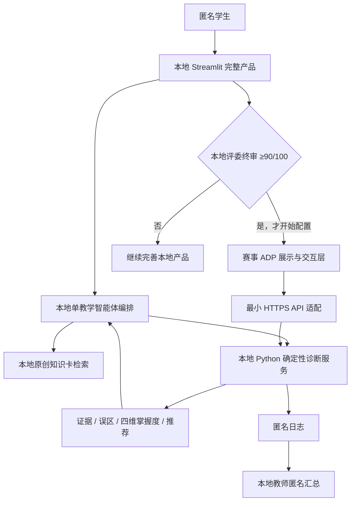

# G0.1 赛事 ADP 平台能力探针

## 1. 结论

- 执行日期：2026-07-31
- 执行状态：**G0.1 兼容性探针通过；不决定当前产品架构或主入口**
- 当前开发基线：本地 Streamlit 完整产品
- 确定性核心：本地 Python 服务，不依赖赛事平台
- 后期适配目标：本地产品达标后，通过 HTTPS 自定义 API 插件接入赛事 ADP
- 发布状态：未发布
- 付费状态：未付费
- 上传状态：未上传教材或其他文件

本次探针只回答“以后能否适配赛事平台”，不能把 ADP 变成当前开发依赖。本地项目必须先独立
完成学生旅程、教师匿名汇总、知识检索、诊断、渐进提示、评测、真实试点和断网演示。只有
本地产品在 2026-08-27 通过评委终审并达到内部 90/100 后，才开始 ADP 配置与联调；适配失败
不影响本地产品继续参赛和演示。

## 2. 实测环境

| 项目 | 实测结果 |
| --- | --- |
| 教学门户 | `https://tengxun.gaoxiaobang.com/`，可正常登录 |
| ADP 空间 | “大赛专用空间”，可进入应用、知识库、插件、模型和原子能力页面 |
| ADP 管理页面 | 当前实例使用明文 HTTP IP 地址 |
| 草稿应用 | 已创建标准模式草稿 `G01-知迹StatPy平台探针` |
| 草稿工作流 | 已创建 `测试诊断接口`，保持待发布 |
| API 插件 | 已创建 `G01-诊断接口探针` |
| Python 插件 | 已创建 `G01-Python沙箱探针` |

文档不记录账号、手机号、身份证、会话信息、应用 ID、插件 ID 或其他可用于访问平台的信息。

## 3. 能力验证矩阵

| 能力 | 结论 | 实测证据 | 对正式作品的决定 |
| --- | --- | --- | --- |
| 创建草稿应用 | 通过 | 标准模式应用创建成功，状态为未上线/待发布 | 本地产品达标后可增加 ADP 展示层 |
| 工作流 | 通过 | 可创建工作流；画布提供开始、结束、知识检索、插件、工具、代码、条件、数据库、循环等节点 | 后期可编排“提交 → 本地确定性诊断 → 展示”，不替代本地闭环 |
| 外部 HTTPS | 通过 | 对公开回显接口发起 GET，取得完整原始响应 | 后期可调用团队自有 HTTPS Python 服务 |
| Header 鉴权 | 通过 | 平台把虚拟 `X-Probe-Token` Header 发送到回显接口并被原样返回 | 正式接口可使用受限、可轮换的 API Key |
| OAuth 2.0 | 配置面可用，未实调 | 自定义 API 插件提供“不授权、APIkey、OAuth 2.0”三种方式 | 本项目优先使用简单受限 API Key |
| API 调用时延 | 通过基础探针 | 单次公开回显调用约 1.48 秒，包含页面交互等待 | 不能视为性能基准，8 月 28–29 日适配时重新测 P50/P95 |
| 超时配置 | 部分通过 | API 插件向导未出现可配置超时或重试字段 | 超时、重试、幂等和熔断必须由 Python 服务控制 |
| 平台 Python 执行 | 通过 | 固定输入 `[1,2,3,4]` 在托管 Python 环境返回 `{"mean": 2.5}`，约 2.15 秒 | 可用于团队审核过的固定计算，不执行学习者任意代码 |
| 内置代码解释器 | 配置面可用 | 插件广场提供官方代码解释器，可运行 Python 和生成图表 | 暂不作为确定性判题器，避免结果不可控 |
| RAG/知识库 | 配置面可用，未实调 | 平台提供知识库、知识检索和知识库问答插件 | 先完成本地 RAG；G5 若启用平台 RAG，只上传原创知识卡并做一致性评测 |
| 模型 | 通过 | 空间显示企业内置、腾讯混元、腾讯优图、DeepSeek 和 OpenAI Compatible；草稿默认模型上下文为 16K | 先使用赛事空间现有模型，不购买外部模型 |
| 发布 | 有明确边界 | 发布是独立操作；草稿有待发布、发布历史、服务状态和发布渠道；本次未点击发布 | 正式发布前必须取得用户确认 |
| 发布渠道 | 部分通过 | 页面可新增企业微信应用或企业微信智能机器人；未确认公开 Web 体验链接 | 8 月 29 日前必须验证学生测试账号或可访问体验链接 |
| 配额 | 未披露 | 赛事空间没有自助计费或用量入口 | 不虚构额度；上线前做小规模调用和失败降级测试 |
| 浏览器稳定性 | 有风险 | 核心 HTTP 与 Python 探针成功，但管理端出现 Monaco/Vue 前端错误日志 | 不让平台稳定性影响本地产品；后期按验收结果缩小适配范围 |

## 4. 安全边界

### 4.1 必须遵守

1. 学习者只使用随机匿名 ID，不提交姓名、学号、手机号或身份证信息。
2. 正式 Python 工具接口必须使用 HTTPS；禁止把本地服务以明文 HTTP 暴露到公网。
3. API Key 必须最小权限、可轮换，不能进入 Git、截图、文档或前端代码。
4. ADP 代码插件只能运行团队预先审核的固定函数。
5. 不把学习者输入拼接为 Python、SQL、shell 或表达式后执行。
6. 不上传两本教材 PDF；知识库只使用原创知识卡或明确获授权材料。
7. 模型不得修改确定性分数、误区标签、掌握度或推荐动作。

### 4.2 当前平台风险

- ADP 管理端当前使用明文 HTTP，浏览器日志也明确提示 HTTP 不支持麦克风、摄像头和屏幕捕获。
- 教学门户本身使用 HTTPS，但进入 ADP 的授权目标指向 HTTP 管理页面。
- 因此作品不使用语音、视频或屏幕共享，也不在 ADP 中保存身份信息。
- 若平台无法安全保存长期凭证，只能使用短期、最小权限、限流且可随时吊销的服务端令牌；
  如果连这一条件也不能满足，停止需要凭证的 ADP 适配。
- 最终学生体验链接若仍为明文 HTTP，只允许使用匿名低敏测试数据，并在材料中说明限制；
  本地 Streamlit 完整产品始终保留为正式验收和演示基线。

## 5. 本地优先架构与后期 ADP 适配

### 5.1 固定开发顺序

1. 先在本地完成结构化输入、判题、证据、误区、知识检索、渐进提示、掌握度和推荐；
2. 再完成本地学生主路径、教师匿名汇总、一键启动、评测和断网演示；
3. 在本地完成平台无关的最小 HTTPS API 契约和模拟客户端测试，但不连接 ADP；
4. 完成真实试点和材料，由评委 Agent 对本地版本终审；
5. 本地内部评分达到 90/100 后，才把已验证的能力接入 ADP，平台只承担赛事展示和交互适配。

### 5.2 停止或缩小 ADP 适配的条件

以下任一条件成立，不再强行集成；本地完整产品保持不变：

1. 8 月 29 日前无法让学生测试账号访问草稿或正式体验链接；
2. ADP 到 Python HTTPS 工具端到端成功率低于 95%；
3. 平台不能隐藏真实 API Key，或只能把 Key 暴露给学生端；
4. 模型/API 失败会造成状态重复写入或“已更新但无回执”；
5. 连续 5 次核心演示出现严重故障；
6. 赛事方明确禁止调用自建 HTTPS 工具；
7. 已知赛事配额无法覆盖 15 人试用、演示彩排、失败重试和至少 30% 安全余量；
8. 8 月 29 日仍无法取得可信配额信息，且模拟演示负载期间出现限流，或端到端成功率低于 95%。

## 6. G5 后期适配约束

### 6.1 API 契约

正式接口至少需要：

- `GET /health`
- `POST /v1/diagnose`
- `POST /v1/hint`
- `POST /v1/recommend`

请求与响应使用 Pydantic schema，包含 `schema_version`、`request_id` 和幂等键。客户端超时后
可以重试，但同一提交不能重复更新掌握度。

### 6.2 延迟和故障目标

- Python 工具 API 本身 P95 小于 3 秒；
- ADP 端到端成功率至少 95%；
- 超时后返回明确的可重试提示；
- Python 服务不可用时，ADP 不生成或修改分数；
- 本地 Streamlit 始终能独立完成完整诊断闭环。

### 6.3 配额处理

赛事空间没有显示具体额度，因此不写“无限免费”等无法验证的表述。8 月 28–29 日联调时记录：

- 每次学生主旅程的模型调用次数；
- 每次主旅程的工具调用次数；
- 10、15 和 20 个并发模拟下的成功率；
- 失败类型、重试次数和降级次数。

### 6.4 2026-08-29 ADP 适配保留验收

本地完整产品必须先在 2026-08-27 达到内部 90/100；此后 ADP 适配只有同时通过以下测试，
才允许保留为正式在线展示入口：

1. ADP 能以 HTTPS `POST` 发送 JSON，并正确处理 4xx、5xx、超时与非 JSON 错误响应；
2. 同一幂等键在超时重试后不会重复更新掌握度；
3. 正式凭证不出现在学生端、仓库、截图、日志或响应正文中；
4. 真实模型能够基于确定性诊断解释结果，但不能改写分数；
5. 真实原创知识卡 RAG 通过独立检索评测，回答能引用正确知识卡；
6. 至少一个学生测试账号能够从学生入口完成核心旅程；
7. 管理端出现前端错误后，重新登录仍可恢复草稿、工作流和插件配置；
8. 配额能够覆盖 15 人试用、演示彩排、失败重试及至少 30% 安全余量；
9. 端到端成功率不低于 95%，失败时能够降级到不虚构分数的安全提示。

## 7. 本次平台变更

以下对象均为草稿且带有 `G01` 探针标识：

- 标准模式应用；
- 一个工作流；
- 一个 API 插件；
- 一个固定运算 Python 插件。

没有执行：

- 应用发布；
- 发布渠道创建；
- 付费或购买；
- 教材、项目文件或学习者数据上传；
- 真实 API Key 写入；
- 学习者代码执行。

这些草稿可保留作为 G5 配置参考。正式集成时应新建或重命名正式对象，不把探针插件直接当成
生产服务。

## 8. 证据记录说明

本次保留的是去标识化文字证据、脱敏截图和平台草稿。应用列表与账号页面会展示个人姓名、
账号或手机号，因此没有把这些页面截图写入仓库。证据文件为：

1. [工作流节点列表](evidence/g01_workflow_nodes.png)；
2. [APIkey Header 位置、虚拟参数名和无访问能力的虚拟值](evidence/g01_http_dummy_header.png)；
3. [固定 Python 运算结果](evidence/g01_python_fixed_result.png)；
4. [草稿“待发布”状态和可选发布渠道](evidence/g01_draft_unpublished.png)；
5. [脱敏探针日志与前端错误摘要](evidence/g01_probe_log.md)。

截图不包含账号姓名、手机号、账号 ID、应用 ID、插件 ID 或真实密钥。学生 HTTPS 门户已实测，
但页面带有登录账号区域，本轮不保存该截图。

## 9. G0.1 Definition of Done

- [x] 使用赛事专用平台而非腾讯云公共 ADP；
- [x] 登录大赛专用空间；
- [x] 创建未发布的最小应用与工作流；
- [x] 实测外部 HTTPS；
- [x] 实测虚拟 Header 鉴权；
- [x] 识别 OAuth 2.0 配置入口；
- [x] 实测固定 Python 代码执行；
- [x] 检查模型、发布和配额入口；
- [x] 记录平台 HTTP、安全和前端错误风险；
- [x] 冻结“本地完整产品优先、赛事平台后适配”的开发顺序；
- [x] 记录停止或缩小 ADP 适配的量化门槛；
- [x] 保存不含个人信息、对象 ID 或真实密钥的脱敏证据；
- [x] 未发布、未付费、未上传资料、未记录真实密钥。

## 10. 阶段门评审

- 评审角色：评委 Agent（只读复核）；
- 评审结论：**放行进入本地 G1.1**；
- 必须修改项：无；
- 放行范围：仅代表平台兼容性探针完成，不代表 ADP 获得生产放行；
- 方向校准：用户随后确认先完成本地一等奖级产品，再进行赛事平台适配；
- 最终约束：2026-08-29 未通过第 6.4 节全部验收时，停止或缩小 ADP 适配，本地产品不受影响。

## 11. 下一任务

进入本地 G1.1：

> 设计并实现“答案 + 推理 + Python 文本”的结构化证据契约，使诊断能够引用学习者原文，
> 并为“答案正确但推理或代码错误”建立确定性测试。
