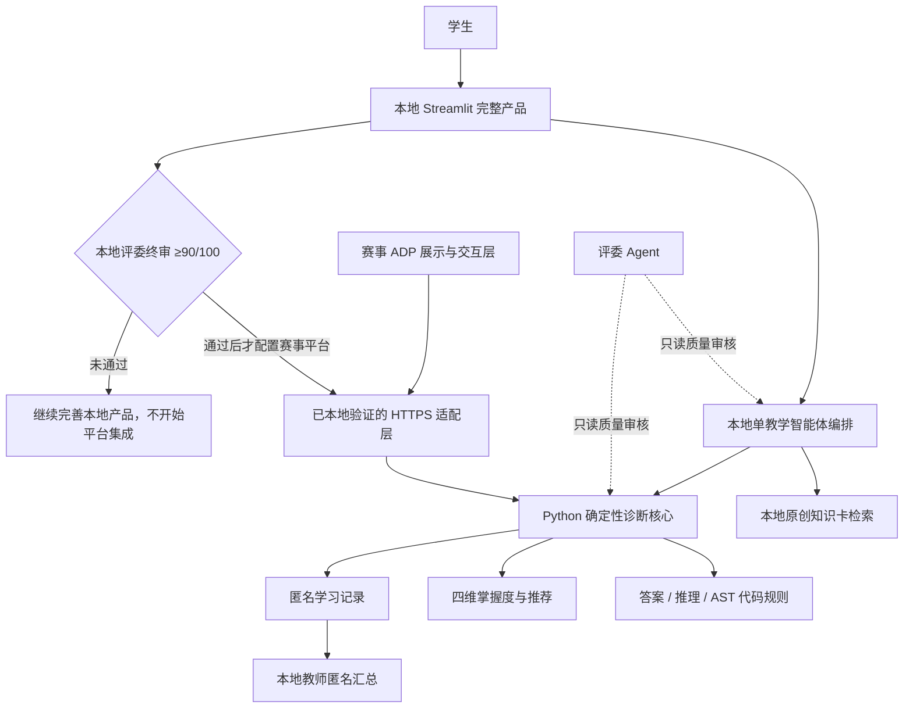

# “知迹·StatPy”省赛一等奖冲刺执行计划

## 0. 文档信息

- 项目全称：知迹·StatPy——概率统计 × Python 数据分析跨学科启发式学习与诊断智能体
- 制定日期：2026-07-30
- 校内硬截止：2026-08-30
- 省赛材料截止：2026-09-06 24:00
- 团队：2 名学生
- 人类可用时间：每人每天约 2–3 小时，但优先让 Codex Agent Team 承担可自动化工作
- 主用户：正在学习《概率论与数理统计》和《Python 数据分析》的高校本科生
- 次用户：任课教师，仅查看匿名汇总、诊断证据和试点评价
- 开发模式：主 Agent 实施，专项 Agent 检查，评委 Agent 只读审核
- 开发顺序：先把本地项目做成可独立运行的一等奖级完整产品，再增加赛事 ADP 适配层

> 重要说明：任何计划都不能诚实保证“90% 获得一等奖”，因为参赛作品水平、评委判断和
> 奖项比例不可控。本计划把可控目标定义为“内部评委评分达到 90/100 以上、所有硬门槛
> 通过”，以此将作品推进到一等奖竞争区间。

## 1. 最终判断

### 1.1 是否值得在现有框架上继续

**值得，而且不应推倒重做。**

当前仓库已经具备：

- 12 道经过 Pydantic 验证的题目；
- 确定性判题；
- “统计概念、数学计算、Python 实现、数据解释”四维掌握度；
- 渐进引导、下一题推荐和 SQLite 持久化；
- 无模型时仍可运行的离线路径；
- 单教学智能体与结构化诊断报告；
- 139 项通过的 pytest 测试和通过的 Ruff 检查；
- 冻结评测基线、开发扩展集和流程隔离的盲测集；
- RAG 资料 manifest、安全路径和完整性检查基础。

这些能力直接支持比赛要求中的“系统完整性”“数据与算法合理性”和“真落地”。重新做一个
普通聊天机器人会丢掉现有最有价值的差异化。

### 1.2 当前距离一等奖有多远

评委 Agent 对当前成品的保守估计为 **56–68/100**。主要差距不是“没有使用 AI”，而是：

- 没有真实学生试点和教师审核证据；
- 只覆盖 4 个知识点、12 道题，不能支撑“两本教材覆盖”的表述；
- 当前 RAG 只有资料治理和加载，还没有检索、引用和回答约束闭环；
- 困难回答的诊断指标较低；
- 学生界面仍是开发版 Streamlit；
- 没有比赛级说明书、5 分钟视频、答辩证据链和本地完整演示保障。

### 1.3 当前真实基线

| 数据集 | 数量 | 判题准确率 | 误区标签准确率 | 建议匹配率 |
| --- | ---: | ---: | ---: | ---: |
| v0.1 冻结集 | 36 | 83.33% | 72.22% | 83.33% |
| v0.2 开发扩展集 | 32 | 53.12% | 21.88% | 53.12% |
| v0.2 盲测集 | 16 | 62.50% | 31.25% | 62.50% |

低指标揭示的是实质问题：当前判题主要读取 `answer`，还不能可靠处理“答案表面正确，但推理、
条件、Python 代码或解释错误”的回答；误区标签也偏向返回题目预设候选，而不是从学生原文中
识别具体误区。

## 2. 一等奖版本的产品定义

### 2.1 一句话价值主张

> 通用大模型往往直接给答案或凭语言感觉评分；知迹·StatPy 先用可测试程序分析学生的答案、
> 推理和 Python 代码证据，再让智能体用渐进提示解释“具体卡在哪里”，并推荐下一步练习。

### 2.2 必须讲清的五个差异化点

1. **模型不决定分数**：正确性、误区事实、掌握度和推荐由确定性程序产生。
2. **四维诊断**：把统计概念、数学计算、Python 实现、数据解释分别诊断，识别“会算不会解释”
   等跨学科困难。
3. **证据可追溯**：每个诊断必须引用学生答案、推理或代码中的可观察片段和规则 ID。
4. **答案渐进披露**：概念线索 → 方法线索 → 部分步骤 → 完整解释，不立即泄露答案。
5. **广度与深度分层**：两本教材的 22 章只做课程目录映射，8 个核心单元才提供原创知识卡、
   测试和教师审核过的深度诊断。

### 2.3 两本教材的覆盖边界

课程目录映射覆盖：

- 同济大学数学系《概率论与数理统计》的 8 章；
- Wes McKinney《利用 Python 进行数据分析（第 2 版）》的 14 章。

“覆盖 22 章”只表示建立章节—知识点—深度单元之间的**目录映射**，不表示 22 章都能进行
高质量问答或诊断。RAG 知识卡和确定性深度诊断固定为 8 个单元：

1. 数据加载、缺失值与数据质量；
2. 均值、中位数、方差、异常值与描述统计；
3. 概率规则与 NumPy 随机模拟；
4. 常用分布及其 Python 表达；
5. 联合分布、协方差、相关与分组分析；
6. 抽样分布、中心极限定理和标准误；
7. 参数估计与置信区间；
8. 假设检验与小型 A/B 数据分析。

每个单元最低包含 3 道受审的综合诊断题，并尽量在题组中覆盖：

- 统计概念；
- 数学计算；
- Python 实现；
- 数据解释。

**24 道教师审核题是必须完成线，28–32 道是加分线**，现有 12 道计入。题目数量不能以牺牲
证据规则、测试和教师审核为代价。

### 2.4 版权和资料规则

- 教师已经确认教材可用于比赛，并预约参与内容审核；
- 仍应保留聊天或邮件文字记录，记录允许的使用范围；
- 不把带有非官方电子书站标记的 PDF 上传到 ADP、比赛官网、GitHub 或测试账号；
- 教材只用于章节映射、事实核对和定位出处；
- ADP 知识库只上传团队原创知识卡、明确获授权材料或开放许可资料；
- 知识卡使用概念重述和团队原创例子，不大段复制教材原文；
- 每张知识卡记录教材名称、章/节、编写者、审核者、版本、授权和答案泄露风险。

## 3. 本地优先、平台后适配的最终系统架构



### 3.1 平台职责

| 部分 | 职责 | 不允许承担的职责 |
| --- | --- | --- |
| 本地 Streamlit 产品 | 完整学生旅程、教师匿名汇总、离线演示和产品验收基线 | 把关键能力推迟到 ADP 中实现 |
| Python 核心 | 判题、证据提取、误区规则、检索、提示策略、掌握度、推荐、匿名日志 | 生成无依据的教学结论 |
| 腾讯云 ADP 适配层 | 本地产品达标后的赛事交互、工作流和在线展示 | 成为本地开发依赖；自行修改分数、误区或推荐 |
| 比赛官网 | 报名、材料上传、最终提交 | 作为唯一运行环境 |

本地产品必须先完成全部核心功能、评测、内容、体验和演示闭环，不依赖 ADP、外部网络或赛事
账号才能验收。模型不可用时也必须有安全、可解释的本地降级输出。

G0.1 已证明 ADP 具备调用外部 HTTPS 服务和运行固定 Python 工具的基础能力，这只表示未来
适配可行，不决定当前产品架构。G1–G4 不操作赛事平台，只完成本地产品、平台无关接口、评测、
真实试点和材料。只有本地版本通过 8 月 27 日评委终审并达到内部 90/100，才在 8 月 28 日
开始配置 ADP。ADP 集成失败时停止适配，不回头修改或降低本地产品标准。

平台知识库或模型能力只能作为后期展示增强。若启用，必须通过与本地检索、诊断和提示策略的
一致性测试；平台不得成为知识、分数、误区、掌握度或推荐的唯一事实源。

### 3.2 产品保持单智能体

Agent Team 只用于**开发过程**，不是面向学生的多智能体产品功能。参赛作品保持一个教学智能体，
避免为了技术名词增加路由、延迟、调试和答辩解释成本。

### 3.3 Python 代码安全

- 本地完整产品不执行学习者的任意代码；
- 本地 Python 题采用 AST 结构检查、输出预测、代码片段选择和固定事实比较；
- 禁止在 Web、service、智能体或测试主进程中对学生代码使用 `eval()`、`exec()` 或 shell；
- ADP 代码插件只允许运行团队预先审核的固定适配函数，不承担本地核心判题；
- 不在四周计划内自建 Docker 多租户代码沙箱。

## 4. 主 Agent 实施原则

### 4.1 Agent Team 分工

| 角色 | 权限 | 主要产出 |
| --- | --- | --- |
| 主 Agent | 唯一默认写代码和合并者 | 实现、测试、文档、材料初稿 |
| 内容 Agent | 只修改分配的知识卡/题目文件或给出草稿 | 8 单元内容、知识图谱、题目初稿 |
| 开发评测 Agent | 不读取盲测逐条标签，不改业务代码 | 开发集诊断、指标和失败类别 |
| 体验 Agent | 基于截图提出改版意见 | 学生旅程、教师汇总、视频画面清单 |
| 安全/隐私 Agent | 只读审查 | 密钥、数据、上传、日志和授权风险 |
| 评委 Agent | 对业务代码只读；独占创建和封存盲测标签；8/22、8/27 正式评分 | 五维评分、盲测聚合结果、否决项和修复清单 |

规则：

- 同一时间只有主 Agent 修改核心业务模块；
- 子 Agent 不擅自扩大产品范围；
- 盲测标签文件只由评委 Agent 创建、读取和校验；主 Agent 只看文件指纹、数量、分层清单和
  正式运行后的聚合指标，不打开逐例答案；
- 评委 Agent 的正式评分必须基于可运行版本和证据文件；
- 发布、付费、上传教材、ADP 正式上线和比赛最终提交必须由用户确认。

### 4.2 两名人类成员的最低必要工作

| 人员 | 必须由人完成 | 可交给 Codex |
| --- | --- | --- |
| 成员 A（技术） | 登录平台、保管密钥、确认发布、最终演示 | 编码、测试、部署脚本、技术文档 |
| 成员 B（内容/试点） | 教师联络、学生组织、知情同意、真实反馈 | 题目草稿、问卷、报告、视频脚本 |
| 教师 | 审核知识图谱、题目、诊断规则和前后测等价性 | Codex 先生成审核包和表格 |

建议的人类固定检查时间：

- 每晚 20 分钟：只看当日演示和阻塞项；
- 每个阶段门 30–45 分钟：批准继续、砍范围或返工；
- 试点日 60–90 分钟：组织学生并处理同意；
- 8 月 29 日 60 分钟：完整答辩彩排。

## 5. 四周详细计划表

### 阶段 G0：冻结范围与证据规则（7 月 30–31 日）

| 日期 | 主 Agent / Agent Team | 人类任务 | 可验证产出 | 通过条件 |
| --- | --- | --- | --- | --- |
| 7/30 | 完成仓库、比赛、教材目录和平台能力审查 | 确认关键决策 | 本计划、现状评分、风险清单 | 关键决策树无未决分支 |
| 7/31 | 建立比赛证据矩阵、Agent 权限规则和材料骨架；完成 ADP 最小兼容性探针；冻结“本地优先、平台后适配”顺序 | 30 分钟范围确认并登录平台；成员 B 邀请 3–5 名目标学生异步简答 | 产品简报、平台探针、路线边界、访谈模板 | 8 单元、24 题必须线、单智能体和本地优先顺序冻结 |

**G0 失败处理：** 如果团队希望增加多智能体、完整教师后台或两本教材全章节深诊断，立即拒绝
并回到本计划范围。

### 阶段 G1：先修复诊断事实链（8 月 1–6 日）

| 日期 | 主 Agent / Agent Team | 人类任务 | 可验证产出 | 通过条件 |
| --- | --- | --- | --- | --- |
| 8/1 | 定义结构化 `LearnerSubmission`、证据、规则和误区 schema；归档已取得的教师授权 | 技术成员确认本地输入体验 | 答案/推理/代码分离的数据契约 | Pydantic 校验和中文错误信息完整 |
| 8/2 | 修复在线模型失败时“状态已写但回执未保存”；隔离模型写状态副作用 | 无 | 事务/幂等设计和回归测试 | API/模型失败不重复更新掌握度 |
| 8/3 | 让 grader 同时分析答案、推理和 Python 文本；代码仅做 AST 静态检查 | 无 | 多证据 grader 与单元测试 | 不执行任意学生代码 |
| 8/4 | 实现高频错误规则并修复推荐映射 | 内容成员和教师抽查 6 个失败例 | 误区证据、规则 ID、推荐理由测试 | 每个误区引用可观察原文 |
| 8/5 | 开发集回归和失败分类，只修高频根因；归档 3–5 份匿名痛点简答 | 内容成员抽查失败分类 | 指标报告、失败样本分类、匿名痛点摘要 | 开发集 ≥80% / 65% / 80% |
| 8/6 | 完成本地 G1 诊断闭环回归和阶段评审 | 30 分钟 G1 评审 | 本地演示、回归报告、G2 放行单 | 核心旅程无需 ADP 即可运行 |

表中三个比例依次表示：判题准确率 / 误区标签准确率 / 建议匹配率。

**G1 失败处理：**

1. 暂停扩题；
2. 优先修复“答案对但推理或代码错”和“无关/信息不足”；
3. 不通过增加大模型自由裁量来虚假提高确定性指标；
4. 8 月 7 日仍未达标时，冻结 24 道必须线，取消 28–32 道加分目标。

### 阶段 G2：8 个单元内容与知识图谱（8 月 7–14 日）

| 日期 | 内容范围 | Codex 产出 | 人类/教师检查 | 通过条件 |
| --- | --- | --- | --- | --- |
| 8/7 | 单元 1：数据质量 | 迁移“每知识点固定 3 题型”的旧 schema；产出 3 道综合题、4 级提示、规则、知识卡；细化视频分镜 | 内容成员抽查 | 新旧题库都能验证，测试全过 |
| 8/8 | 单元 2：描述统计 | 复用并升级现有题；补异常值证据，至少 3 道受审题 | 内容成员抽查 | 测试全过 |
| 8/9 | 单元 3：概率模拟 | 至少 3 道题、NumPy 静态代码规则 | 内容成员抽查 | 无代码执行 |
| 8/10 | 单元 4：常用分布 | 至少 3 道题、分布选择误区 | 教师批量初审 1–4 | 无事实错误 |
| 8/11 | 单元 5：联合分布与相关 | 至少 3 道题、相关不等于因果规则 | 内容成员抽查 | 证据可追溯 |
| 8/12 | 单元 6：抽样与标准误 | 升级现有题，补模拟映射，至少 3 道受审题 | 内容成员抽查 | 测试全过 |
| 8/13 | 单元 7：估计与置信区间 | 升级现有题，补区间解释，至少 3 道受审题 | 内容成员抽查 | 测试全过 |
| 8/14 | 单元 8：假设检验/A-B | 至少 3 道题、合成数据、主视频案例 | 教师审核 5–8 和目录映射 | 教师确认内容与规则 |

每道题的 Definition of Done：

- 题目、数据、答案和容差明确；
- 四维权重有理由；
- 至少一个具体误区规则；
- 四级提示按顺序披露；
- 完整解释同时包含概念、计算、Python 和情境解释；
- 至少一个正确、一个错误、一个边界测试；
- 不执行学生代码；
- 教师审核状态可追溯。

盲测独立性规则：

- 每完成一个单元，评委 Agent 独立建立并封存至少 6 个该单元盲测例，覆盖正确、推理错、
  代码错、结论错和信息不足等类型；
- 主 Agent 只能看到分层数量和数据集指纹，不能打开逐例输入、标签或期望动作；
- 教师在不把标签交给主 Agent 的前提下，随机抽查整套盲测中的 8 例；
- 8 月 15 日只校验封存集数量、分层和指纹，不临时突击生成标签；
- 正式运行后，评委 Agent 仅返回聚合指标和类别级失败，不返回可用于逐例调参的答案。

**G2 失败处理：**

- 进度正常：先完成 24 道必须线，再追加至 28–32 道；
- 延误 1 天：停止加分题，减少装饰性知识卡；
- 延误 2 天：保持 24 道和 8 单元各至少 3 题，不再扩量；
- 不允许删除单元 6、7、8，因为它们构成主展示的统计推断链。

### 阶段 G3：完成本地产品与平台无关接口（8 月 15–20 日）

| 日期 | 主 Agent / Agent Team | 人类任务 | 可验证产出 | 通过条件 |
| --- | --- | --- | --- | --- |
| 8/15 | 生成 22 章课程目录映射并整合 8 单元原创知识卡；实现本地切分、索引、检索、引用和无结果降级；校验至少 48 个封存盲测例 | 内容成员抽查引用；教师完成 8 例盲测抽查，不把标签交给实现 Agent | 本地 RAG 闭环、目录映射、manifest、checksum、单元测试、盲测分层表和指纹 | 无教材 PDF 入库；离线可检索；无结果时不编造；每单元至少 6 个盲测例 |
| 8/16 | 建立检索评测集、答案泄露规则和引用格式；按失败类别调优本地检索 | 教师抽查知识卡 | Recall@k、引用正确率、无结果降级报告 | Recall@3 ≥90%，引用正确 ≥95%，无结果降级测试全过 |
| 8/17 | 完成本地 Streamlit 学生主路径、教师匿名汇总、一键启动、故障日志和断网降级 | 两名成员各做一次本地流程干跑 | 本地完整产品候选版、截图、启动验证 | 本地核心旅程连续演示 5 次无严重故障 |
| 8/18 | 增加平台无关的最小 HTTPS API 契约和健康检查，并使用本地模拟客户端测试 | 无平台操作 | `/health`、诊断接口、Pydantic 契约和本地契约测试 | 关闭网络后 Streamlit 核心旅程仍完整可用 |
| 8/19 | 完成超时、重试、幂等、熔断和离线降级；完成本地学生旅程可用性检查 | 两名成员各做一次本地流程干跑 | 故障注入、本地界面截图、问题清单 | API/模型失败不破坏学习状态 |
| 8/20 | 实现误区 precision/recall/F1 和配对结果报告；冻结本地功能范围 | 45 分钟 G3 评审 | 本地端到端录像、评测报告、冻结清单 | 本地完整产品达标；尚未调用或配置 ADP |

从 **8 月 20 日 24:00** 起禁止新增功能。

### 阶段 G4：体验、评委初审与真实试点（8 月 21–25 日）

| 日期 | 主 Agent / Agent Team | 人类任务 | 可验证产出 | 通过条件 |
| --- | --- | --- | --- | --- |
| 8/21 | 完成强制对照实验、教师匿名汇总和试点材料；由脚本随机隐藏输出来源，评委 Agent 按冻结量表盲评 | 教师终审前后测并抽查 6 个对照例 | 至少 30 个困难回答的盲化对照、知情同意、问卷、主持稿 | 事实正确 ≥90%，证据/建议各 ≥85%，对通用 LLM 和静态答案的胜或平比例 ≥70%，一级提示泄露为 0 |
| 8/22 | 评委 Agent 第一次正式盲审；只修 P0/P1 问题 | 确认是否进入试点 | 五维评分、缺陷清单、内容冻结 | 无一票否决项，内部 ≥82/100 |
| 8/23 | 使用本地完整产品进行一场 60–90 分钟试点；若人数不足则 8/24 补齐 | 组织 10–15 名学生 | 匿名作答、错误日志、问卷 | 严重故障 0 |
| 8/24 | 完成或补齐试点；教师填写专家评价 | 教师抽查诊断证据 | 教师评价表、2 个匿名案例 | 教师均值 ≥4/5 |
| 8/25 | 生成配对分析、材料包和 5 分钟视频 v1，主 Agent 核对不过度宣称 | 内容成员核对匿名性，两名成员观看视频 | 试点报告、比赛图表、完整材料 v1、视频 v1 | 完成率 ≥80%，所有结果如实报告且可追溯 |

试点采用：

- 15–20 分钟前测：4 组综合题，合计覆盖 8 个深度单元；
- 30–40 分钟系统学习；
- 15–20 分钟等价后测：同蓝图、同难度、不复用原题；
- 5–8 分钟问卷与开放反馈。

前后测题和评分规则必须在试点前冻结。试点报告必须展示配对差值、区间估计、个体分布和
缺失/退出情况。以下是观察目标，不是筛选或篡改结果的放行条件：

- 后测中位数较前测提升至少 10 个百分点；
- 至少 70% 的学生后测高于前测；
- 首次错误后的订正成功率至少 60%；
- 教师抽查的误区标签一致率至少 80%；
- 推荐匹配率至少 80%；
- 易用、帮助、相关性、继续使用意愿等问卷均值至少 4/5；
- 至少形成 2 个完整匿名证据案例。

允许的结论：

> 在本次 10–15 人小规模试点中观察到即时表现改善，系统具有可用性和初步教学潜力。

禁止的结论：

- 已证明长期提升学习成绩；
- 对所有高校学生普遍有效；
- 小样本结果证明因果关系；
- 掌握度可用于考试、升学或能力认证。

### 阶段 G5：冻结、材料、视频与提交（8 月 26–30 日）

| 日期 | 主 Agent / Agent Team | 人类任务 | 可验证产出 | 通过条件 |
| --- | --- | --- | --- | --- |
| 8/26 | 只修试点暴露的 P0/P1；把真实证据填入既有材料骨架；制作视频 v2 | 内容成员校对事实 | 变更日志、材料 v2、视频 v2 | 所有数字可追溯 |
| 8/27 | 评委 Agent 对本地完整产品第二次盲审；只处理阻止提交的问题 | 两名成员观看成片 | 本地最终评分卡、缺陷清单、视频候选终版 | 本地版本内部评分 ≥90/100，才允许开始 ADP 适配 |
| 8/28 | 冻结本地核心；若 8/27 放行，则部署已验证的通用 HTTPS 接口并配置 ADP 草稿；否则只修本地阻塞项 | 用户批准本地冻结；需要时配置短期受限密钥 | 本地版本号、最终测试报告、ADP 草稿或阻塞清单 | ADP 不修改本地核心，未发布 |
| 8/29 | 验证 ADP 适配和结果一致性；完成本地/ADP（若通过）/断网彩排，不新增本地功能 | 两人完整答辩彩排；用户决定是否保留 ADP 入口 | 适配报告、讲稿、Q&A、备份包 | 本地主路径三次通过；ADP 成功率 ≥95% 才保留 |
| 8/30 | 校内提交前逐文件校验；用户确认正式操作 | 用户执行/确认提交 | 提交回执、双备份 | 文件可打开、链接可访问 |

## 6. 5 分钟视频结构

| 时间 | 内容 | 必须出现的证据 |
| --- | --- | --- |
| 0:00–0:25 | 真实痛点 | 学生“会算不会解释、会代码不会统计”的具体困难 |
| 0:25–0:50 | 产品定位 | 两本课程图谱、8 个深度单元、不是普通问答 |
| 0:50–2:35 | A/B 学习实验主旅程 | 数据清洗 → 错答 → 证据诊断 → 渐进提示 → 订正 |
| 2:35–3:15 | 技术可信度 | 模型不判分、确定性工具、RAG 引用、离线兜底 |
| 3:15–4:05 | 真实试点 | 前后测配对图、订正率、教师评分、匿名案例 |
| 4:05–4:35 | 创新与推广 | 课程映射方式、可复用题目 schema、其他课程扩展路径 |
| 4:35–5:00 | 总结 | 解决了什么问题、为什么可靠、为什么可落地 |

视频只演示一个核心旅程，不在 5 分钟内遍历全部功能。

## 7. 内部 92 分目标与证据矩阵

| 赛事评分项 | 权重 | 内部目标 | 必须提交或展示的证据 |
| --- | ---: | ---: | --- |
| 需求分析与场景真实性 | 25 | 23 | 教师审核、3–5 份匿名痛点简答、10–15 人试点、2 个匿名案例 |
| 创新性与实用性 | 25 | 23 | 四维证据诊断、与通用 LLM/静态题库对照、订正与后测结果 |
| 技术实现与系统完整性 | 20 | 18 | 本地完整产品、平台无关 API 契约、全测、监控、离线运行和故障注入证据 |
| 数据使用与算法合理性 | 15 | 14 | 三套评测集、规则说明、RAG 指标、隐私与版权记录 |
| 用户体验与展示效果 | 15 | 14 | 任务完成率、清晰学生旅程、教师汇总页、5 分钟视频 |
| **合计** | **100** | **92** | 低于 90 不进入最终提交状态 |

8 月 27 日本地终审的 92 分目标不计算 ADP 适配。8 月 28 日之后通过验收的平台展示只能增加
落地呈现，不能补足本地产品未达到的评分门槛。

以下两组对照是强制证据，不是可选加分项，且不得夸大实验结论：

1. 固定一个通用 LLM 版本和提示词，用同一批至少 30 个困难回答，与静态答案页和
   知迹·StatPy 对照；脚本随机隐藏输出来源，评委 Agent 按冻结量表比较事实正确、
   证据引用、答案泄露和建议可执行性，教师只抽查 6 例，并保留失败案例；
2. 有 RAG 引用与无 RAG 的回答，比较引用正确率和无依据陈述。

对照实验放行门槛为：知迹·StatPy 事实正确率不低于 90%，证据可追溯和建议可执行性各不低于
85%，在后二项上相对通用 LLM 与静态答案页的逐例结果“胜或平”比例不低于 70%，一级提示
答案泄露率为 0。任何一项未达标都必须在材料中如实说明，且创新性内部目标不得按 23/25 计分。

## 8. 最终硬门槛

### 8.1 工程

- 全部 pytest 通过；
- Ruff 通过；
- v0.1 的案例内容和指纹不漂移；诊断算法改进引起的指标变化必须人工复核、记录原因并生成新版本基线，禁止静默改写旧基线；
- 代码中不执行学习者任意代码；
- 不提交密钥、教材 PDF、姓名、学号或原始身份信息；
- 相同提交不重复更新状态；
- API/模型失败不造成“状态更新但没有回执”；
- 本地完整主路径连续演示 5 次无严重故障；
- 本地核心闭环在断网条件下可演示，ADP 不可用不影响本地验收。

### 8.2 评测

- 开发扩展集：判题 ≥90%、误区 ≥85%、建议 ≥90%；
- 正式盲测至少 48 例，按 8 单元和关键错误类型分层；
- 正式盲测：判题 ≥90%、误区多标签 F1 ≥85%、建议 ≥90%；
- 同时报告误区 exact-match、precision、recall、F1 及区间估计，不只报告一个准确率；
- 每个关键错误类型至少 4 例，召回率不低于 75%，不得存在系统性漏判；
- 一级提示答案泄露率为 0；
- RAG Recall@3 ≥90%；
- 引用正确率 ≥95%；
- 本地检索、引用和无结果降级不依赖 ADP；
- 评委 Agent 终审 ≥90/100。

### 8.3 内容和试点

- 8 个深度单元全部完成；
- 24–32 道题通过自动测试和教师审核；
- 教师内容正确性评分不低于 4/5；
- 10–15 名匿名学生完成一次试点；
- 严重故障为 0；
- 试点完成率 ≥80%；
- 至少 2 个诊断案例可以追溯完整证据链。

## 9. 每日验收命令

```bash
.venv/bin/python -m pytest
.venv/bin/python -m ruff check .
git diff --check
git status --short
```

开发集验收：

```bash
.venv/bin/python evals/run_evals.py --dataset development
```

历史基线审计（算法行为有意升级时允许失败，但必须逐项复核差异并生成版本化新基线）：

```bash
.venv/bin/python evals/run_evals.py \
  --check-baseline evals/baselines/v0.1-mvp.json
```

盲测只能由评委 Agent 在 8 月 22 日和 8 月 27 日运行：

```bash
.venv/bin/python evals/run_evals.py --dataset blind
```

本地演示：

```bash
.venv/bin/python -m streamlit run app.py
```

每个功能任务结束时还必须执行其针对性测试，不能只依赖完整测试“碰巧通过”。

## 10. 风险与自动砍范围规则

| 风险 | 最早预警 | 处理办法 | 禁止的错误应对 |
| --- | --- | --- | --- |
| 困难样本指标低 | 8/6 开发集未达 G1 | 暂停扩题，修证据规则；冻结 24 道必须线 | 让 LLM 自由决定分数 |
| ADP 后期适配失败 | 8/28–29 联调成功率低于 95% 或凭证/配额不安全 | 停止对应平台集成，保留本地完整产品和有限平台展示 | 为迁就平台返工或降低本地核心质量 |
| RAG 引用不可靠 | 8/16 引用正确率低 | 缩小知识卡、改 chunk、加无结果降级 | 上传整本教材碰运气 |
| 内容制作延期 | 任一两日批次延期 1 天 | 减少卡片，不减少核心诊断证据 | 每章只做表面问答冒充覆盖 |
| 试点人数不足 | 8/20 少于 10 人确认 | 8/23、24 分两批；最低报告实际人数 | 虚构学生数据 |
| 试点结果不理想 | 后测无提升 | 如实报告失败类别并用案例证明诊断价值 | 只挑成功学生或改写原始数据 |
| 界面来不及 | 8/19 两人干跑失败 | 保留 4 个主页面，删除动画和装饰 | 重写前端框架 |
| 视频延期 | 8/24 仍缺完整画面素材 | 使用 7/31 分镜和固定录屏模板，不做复杂动画 | 压缩技术/试点证据 |

绝不进入本次范围：

- 面向学生的多智能体协作；
- BKT 或 IRT 等未经校准的复杂测量模型；
- 任意代码 Docker 沙箱；
- 完整教师后台、班级管理、账号注册；
- 语音、图片识别、排行榜和社交；
- 自动生成后无需审核直接入库的新题；
- 教材全文上传；
- 为了视觉效果重写整套前端。

## 11. 最终材料包

建议在后续任务中逐步生成：

```text
docs/competition/
├── product_brief.md
├── requirements_traceability.md
├── architecture.md
├── algorithm_and_data.md
├── knowledge_and_copyright.md
├── privacy_and_consent.md
├── teacher_review_form.md
├── pilot_protocol.md
├── pilot_report.md
├── test_and_eval_report.md
├── judge_scorecard.md
├── design_specification.docx
├── video_script.md
├── defense_script_and_qa.md
└── submission_checklist.md
```

提交包应包含：

- 报名表；
- 智能体设计说明书；
- 不超过 5 分钟的演示视频；
- 程序源码或可执行程序；
- 本地完整产品的一键启动与断网演示说明；
- 通过验收的 ADP 适配配置说明；若未通过则附限制清单和有限展示说明；
- 可选在线链接和测试账号；
- README 与一键启动说明；
- 教师授权/审核记录；
- 匿名试点报告；
- 测试、评测、隐私和安全说明；
- 断网演示备份。

## 12. 当前执行位置与下一步

- G0.1 已完成：仅证明后期 ADP 适配可行，不改变本地优先架构；
- G1.1 已完成：建立“答案 + 推理 + Python 文本”的结构化提交与可观察证据契约；
- G1.2 已完成：诊断改为先内存计算、后原子提交，模型或事务失败不写学习状态、回执或
  SDK 会话；相同提交并发只更新一次，不同提交使用快照冲突重试。阶段门评委审核为 PASS，
  P0/P1 均为 0。
- G1.3 已完成：确定性 grader 联合分析答案、推理和 Python 文本；Python 仅用有界 AST 静态
  分析，并按赋值时序追踪结果依赖，不执行学习者代码。development 判题/标签/建议分别为
  100%/65.62%/100%，阶段门评委审核为 PASS，P0/P1 均为 0。现有 blind 因检索意外暴露而
  失去正式盲测资格，后续必须换用未暴露的新封存集和独立评委。
- G1.4 已完成：用封闭的精确 AST 结构和题目级缺失条件规则细分高频误区，推荐由 finding
  确定性映射；错误报告不返回下一题 ID。development 判题/标签/建议为
  100%/90.62%/100%，阶段门评委审核为 PASS，P0/P1 均为 0。
- G1 总验收已完成：219 项测试、五次连续离线旅程、Streamlit 健康检查和教师 6 例抽查包均
  已验证，评委总阶段门为 PASS，P0/P1 均为 0，工程上放行进入 G2。教师签字和 3–5 份匿名
  学生痛点简答尚未完成，不能写成现有比赛证据。
- G2.1 已完成：建立 8 单元、33 知识节点和两本教材 8+14 章的目标目录映射；新增数据质量
  原创知识卡与概念/Python/解释三题；提示升级为 0–4 层，第四层使用四维结构化完整解释；
  Python 缺失计数题要求提交零参数 `isna/isnull→sum` 连通 AST，仍不执行代码。评委首审发现
  带参数伪链后退回，修复复审为 PASS，P0/P1/P2 均为 0。教师审核表仍未签，状态保持
  `pending_teacher_review`。
- G2.2 已完成：将描述统计现有 6 题和均值/中位数、方差/标准差两张原创知识卡迁入
  G2 内容合同；补齐知识节点、四级提示、受控中文答案别名、教师待审状态和版本。两道 Python
  题改为要求学生自行写表达式，严格检查题设变量、列、大小写和 `ddof`，仍不执行代码。
  评委首审因大小写绕过和反向理由误通过而退回，修复复审为 PASS，P0/P1/P2 均为 0。教师审核表
  仍未签，不得宣称获教师批准。
- G2.3 已完成：新增概率规则/独立性和 NumPy 随机模拟两张原创知识卡，以及概念、Python、
  解释三道综合题；理由采用分组全满足与前置/后置否定保护，Python 只做同源 AST 静态检查，
  支持数组/NumPy 均值和两种成功比例写法。评委通过八轮对抗复审收紧反向推理、自然中文变体、
  无关证据和代码等价边界，最终 PASS，P0/P1/P2 均为 0。教师审核表仍未签，内容保持
  `pending_teacher_review`。
- G2.4 已完成：新增离散分布和连续分布两张原创知识卡，以及二项模型概念、SciPy 二项 PMF
  Python、正态分布解释三道综合题；理由分别核对建模条件、参数角色、支持集、密度和点概率，
  Python 只做有界 AST 并拒绝危险调用的简单别名链。评委三轮复审覆盖自然中文、内部反转、
  撤回重述和否定保护，最终 PASS，P0/P1/P2 均为 0。教师审核表仍未签，内容保持
  `pending_teacher_review`。
- G2.5 已完成：新增联合/条件与协方差、相关与 pandas 分组两张原创知识卡，以及联合概率概念、
  pandas named aggregation Python、协方差缩放与相关解释三道综合题；理由分别核对三个分母、
  分组缺失口径、缩放、量纲、样本线性关联和因果边界。Python 只做有界 AST，支持经审核的
  groupby 等价写法，拒绝重绑定、伪聚合、断开结果和危险调用别名。评委多轮对抗审核把自然
  中文、反转、撤回、否定保护和 AST 绕过固化为 30 项专项回归，最终 PASS，P0/P1/P2 均为 0。
  教师审核表仍未签，内容保持 `pending_teacher_review`。
- G2.6 已完成：将抽样分布、中心极限定理、标准误、精度与系统偏差拆成 5 道综合题，并升级
  标准误知识卡、新增 CLT 知识卡；理由分别核对抽样分布对象、CLT 条件、中心与尺度、总体原始
  分布边界、样本量作用和固定偏差。Python 只做有界 AST，支持 `len`、`shape[0]`、`np.size`
  等经审核的等价写法，拒绝错误 `ddof`、错误维度、重绑定、断开结果和危险调用别名。评委多轮
  对抗审核将自然中文、反转/撤回、逐槽否定保护和 AST 绕过固化为 41 项专项回归，最终 PASS，
  P0/P1/P2 均为 0。教师审核表仍未签，内容保持 `pending_teacher_review`。
- G2.7 已完成：将长期覆盖率、置信区间 Python 构造、区间解释、Bias/Var/MSE 与宽度/系统
  偏差拆成 5 道综合题，并升级置信区间知识卡、新增点估计知识卡。Python 只用封闭白名单的
  AST 静态检查，不执行学习者代码；自然中文误区使用有界同义归一化和稳定命题原子识别。评委
  两轮独立对抗审核将预测区间混淆、撤回/反转、系统变量重绑定、伪调用路径、错序端点和区间宽度
  漏检固化为 55 项专项回归，最终 PASS，P0/P1/P2 均为 0。教师审核表仍未签，内容保持
  `pending_teacher_review`。
- G2.8 已完成：新增 p 值决策、Welch Python、一/二类错误与功效、统计/实际
  重要性和实验设计 5 道题，并新增 2 张原创知识卡和 1 份虚构 A/B 数据。
  Python 只用封闭 Welch AST 合同，不执行学习者代码；中文证据支持有界同义、
  否定、末句反转和整段撤回。评委三层对抗审核固化为 83 项专项回归，
  独立黑盒 61/61 通过，最终 PASS，P0/P1/P2 均为 0。教师审核表仍未签，
  内容保持 `pending_teacher_review`。
- G2 工程阶段已完成：题库现有 33 题，8 个深度单元、15 张原创知识卡
  和两本教材 22 章目录映射全部进入工程待审状态。最终显式非 blind 测试
  490/490 通过；应在 G3 实现检索闭环，不得把“有知识卡”误写为“已有 RAG”。
- G3.1 已完成：15 张 manifest 原创知识卡被确定性切分为 478 个本地切片，覆盖
  8 个深度单元和 9 个可练习知识点；检索、引用、双 checksum、渐进披露、
  中英注入防护、渲染后上下文预算、无命中和索引故障降级均已接入 TutorAgent/Service。
  独立评委专项 158/158、显式非 blind 安全清单 549/549 通过，最终阶段门 PASS，
  P0/P1/P2 均为 0。知识卡仍待教师签字。
- G3.2 已完成：建立 64 条冻结 development 和严格来源—章节对评测合同，冻结数据集、索引、
  检索器、评测器及 15 个来源快照。首轮独立 holdout 如实 HOLD 后，只依据聚合类别完成节点
  范围、来源配额、章节意图和 query-only 域门的通用修复；第二套全新 48 条 holdout 只运行
  一次，Target Recall@3 40/40、引用正确 117/120、引用完整 120/120、no-match 8/8，21 项
  门禁全部通过。冻结前评审 PASS，P0/P1/P2 均为 0；两次正式 holdout 运行均已记录。
- G3.3 已完成：学生端使用随机本地匿名档案完成“选题—作答—答错自动 L1—四级提示—诊断—
  本地引用—订正—推荐—下一题”；教师端只从匿名 `LearningState` 聚合并对所有 `k<3` 总体和
  知识点单元格隐藏精确计数与结果；模型/网络失败自动提交确定性报告并写脱敏事件；macOS/
  Windows 启动器、5 次隔离产品旅程和浏览器截图均已形成。全量 617/617 通过。独立评委首审
  HOLD 的两项 P1 修复后复审 PASS，P0/P1 均为 0；Windows 11 实机双击仍待正式材料前完成。
- G3.4 已完成：建立平台无关的版本化 Pydantic/OpenAPI 契约和回环 ASGI 服务，覆盖健康检查、
  推荐、四级提示与原子诊断；请求限长、匿名标识、安全错误、幂等重放、无网络模拟和真实回环
  健康检查均通过。全量 633/633 通过。独立评委两次 HOLD 分别发现推荐存储故障错误码和
  OpenAPI 503 漂移，逐项修复后最终 PASS，P0/P1 均为 0；可选 `X-Request-ID` 的 OpenAPI
  参数描述作为非阻断 P2 转入 G3.5。
- G3.5 已完成：回执保存请求指纹并在顺序/并发路径拒绝同键改正文；可选模型具备硬超时、最多
  3 次有界尝试、进程内熔断和确定性降级；客户端只用原幂等键有限重试 retryable 500/503；
  OpenAPI 与实际 GET/HEAD/POST、请求头和状态码精确一致。无网络演示覆盖 SQLite 回滚、模型
  超时/熔断和 24 个隔离诊断，本机 P95 1.829 ms（不代表线上 SLA）。全量 664/664 通过；
  独立评委增加 socket 禁止、恶意 Python 文件写入、双 Service 线程竞争和超时取消测试，最终
  PASS，P0/P1/P2 均为 0。

- G3.6 已完成：逐项建立比赛要求与 G1–G3 证据追踪，重跑 G1、RAG 公开 development、产品、
  API、可靠性、启动器、OpenAPI、依赖、ruff 和全量测试；发布审计采用 163 文件允许列表，排除
  教材 PDF、密钥、真实身份、本地状态、ADP 探针、失效 blind/holdout 和自校验元数据。
  原仓库全量 671/671 通过；公开包 658/658 通过。允许列表临时重建的 14 个命令全部通过，重建
  审计与源审计逐字段相等，manifest 为
  `9207e8d4c8cc42150230949f5b3002118dcef848a469730c0a60f887478d24ab`。
  独立评委先后发现 blind 依赖测试和旧 manifest 两项发布一致性 P1，修复并按同一哈希复审后
  最终 PASS，P0/P1/P2 均为 0，允许关闭 G1–G3 本地工程阶段门。

G1–G3 的 Codex 本地工程目标至此完成。下一阶段不自动开始 ADP，也不把本地测试包装成真实教学
效果；教师签字、教材许可归档、10–15 人匿名试点、Windows 11 实机、申报表、设计说明书、5 分钟
视频、ADP 适配、正式发布和最终提交仍按 G4–G5 及人工边界执行。当前
`competition_submission_ready=false`，不能宣称内部达到 90 分或拥有确定获奖概率。
