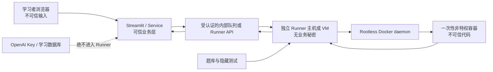

# Learner Code Sandbox：威胁模型与接口设计

## 文档状态

- 状态：仅设计，未实现
- 适用版本：v0.1 禁止执行任意代码；v0.2 Docker 隔离候选方案
- 用户代码范围：学习者提交的 Python 源码
- 重要结论：容器降低风险，但不是等价于虚拟机的绝对安全边界

本文件不授权在当前 Streamlit 进程、教学智能体进程或宿主机上执行学习者代码，也不包含可运行的 Docker 配置、runner 或代码执行入口。

## 1. 安全目标

### 1.1 要保护的资产

- OpenAI API Key、数据库凭据和其他环境变量；
- 学习者状态、作答记录和诊断报告；
- 项目源码、题库、隐藏测试和评分规则；
- 宿主机文件、进程、网络身份和云服务身份；
- Docker daemon、容器运行时和其他容器；
- 服务可用性，包括 CPU、内存、磁盘、进程数和日志容量；
- 运维日志中可能出现的源码、答案或敏感信息。

### 1.2 攻击者假设

学习者提交的任何源码都视为恶意输入。攻击者可能：

- 熟悉 Python 反射、导入系统、文件系统和进程 API；
- 多次提交经过变形的 payload；
- 尝试读取秘密、访问网络、消耗资源或逃逸隔离；
- 利用 Python、第三方包、Linux 内核、Docker daemon 或容器运行时漏洞；
- 将秘密编码、分片或伪装后写入 stdout、stderr 和异常信息。

不能把“用户是初学者”“代码通过 AST 扫描”或“屏蔽了几个危险字符串”当作安全边界。

### 1.3 安全不变量

未来实现必须始终满足：

1. 学习者代码不在 Web、智能体或判题主进程中运行；
2. 学习者不能控制镜像、Docker 参数、挂载、环境变量、网络和资源上限；
3. runner 容器看不到项目目录、Docker socket、宿主机设备和真实秘密；
4. 每次执行使用新的临时容器，完成后销毁；
5. 超时、OOM、fork bomb 和日志洪泛不会拖垮 Web 应用；
6. 输出经过长度限制和敏感信息清洗后才能返回或记录；
7. v0.1 的所有路径都不会执行任意学习者代码。

## 2. 信任边界



关键边界：

- Web 应用只把经过大小限制的代码和不敏感的测试标识发送给 runner；
- Docker daemon 只存在于独立 runner 主机，Web 容器不挂载 `/var/run/docker.sock`；
- 学习者容器只得到本次执行需要的临时文件；
- 隐藏测试由 runner 控制，不接受学习者提供的路径；
- runner 主机不保存 OpenAI Key、生产数据库凭据或个人学习数据。

Docker 官方文档明确指出，控制 Docker daemon 的主体能够创建强权限容器并挂载宿主机目录；把 Docker socket 挂进容器等同于给予其控制 daemon 的能力。因此 Web 应用不得直接获得该 socket。[Docker Engine 安全](https://docs.docker.com/engine/security/)、[docker run 参考](https://docs.docker.com/reference/cli/docker/container/run)

## 3. 威胁分析

| 威胁 | 典型攻击 | 主要影响 | v0.1 | v0.2 核心控制 | 剩余风险 |
| --- | --- | --- | --- | --- | --- |
| 文件读取 | 读取 `.env`、SQLite、题库答案、`/etc`、`/proc` | 秘密和学习数据泄露 | 不执行代码 | 无业务目录挂载；只读根文件系统；仅提供临时工作目录；非 root 用户 | 镜像自身文件仍可见；内核或错误挂载可能破坏边界 |
| 环境变量泄露 | `os.environ`、异常转储、子进程继承 | API Key、代理和凭据泄露 | 不执行代码 | 使用显式空白环境；不继承 runner 环境；镜像中无秘密；禁用云实例凭据 | daemon 或编排配置错误可能注入变量 |
| 网络访问 | HTTP、DNS、回连、扫描内网、访问 metadata endpoint | 数据外传、SSRF、横向移动 | 不执行代码 | `--network none`；不发布端口；runner 主机出站默认拒绝 | 容器逃逸后可能使用宿主网络；loopback 仍存在 |
| 无限循环 | `while True`、递归、超长计算 | CPU 耗尽、队列阻塞 | 不执行代码 | runner 外部硬超时；CPU quota；超时后 `SIGKILL`；容器销毁 | 大量并发请求仍可能耗尽 runner 池 |
| 内存耗尽 | 巨大列表、递归、NumPy 大数组、压缩炸弹 | OOM、宿主机不稳定 | 不执行代码 | memory hard limit；memory-swap 与 memory 相同；限制 `/dev/shm` 和 tmpfs；保留 OOM killer | 宿主机内核和 daemon 仍需预留资源 |
| fork bomb | `os.fork()`、multiprocessing、大量线程/进程 | PID 和 CPU 耗尽 | 不执行代码 | `--pids-limit`；`nproc` 辅助限制；短超时；并发配额 | `nproc` 是按 UID 而非容器计数，不能替代 pids cgroup |
| subprocess | `subprocess`、`os.system`、shell、调用包管理器 | 绕过题目约束、启动攻击工具 | 不执行代码 | 最小镜像；无包管理器和多余二进制；进程限制；定制 seccomp；非 root | 仅屏蔽模块名可被绕过；容器内仍可能执行现有二进制 |
| Python import | 导入 `os`、`socket`、`ctypes`、`importlib` 或危险扩展 | 获得文件、网络、原生代码能力 | 代码只作文本证据 | 只安装教学所需包；禁用 pip；可做 allowlist 作为 UX 检查，但依赖容器边界防护 | Python 反射和间接导入使 allowlist 不能成为主安全控制 |
| 宿主机访问 | bind mount、Docker socket、host PID/IPC/network、设备 | 宿主机接管或数据泄露 | 不执行代码 | 禁止 bind mount 和设备；不使用 host namespace；drop all capabilities；no-new-privileges；只读系统路径 | daemon 配置错误或运行时漏洞仍可能暴露宿主机 |
| 容器逃逸 | 利用内核、runc、Docker 或原生扩展漏洞 | runner 主机接管，进一步横向移动 | 无容器执行面 | 独立可丢弃主机/VM；rootless Docker；及时补丁；seccomp；AppArmor/SELinux；无秘密；最小权限 | Docker 共享宿主内核，无法消除逃逸风险 |
| 日志敏感信息 | 打印环境、源码、答案、token；超长/ANSI/控制字符输出 | 秘密泄露、日志注入、存储耗尽 | 代码不运行，输入不写普通日志 | stdout/stderr 限长；清除控制字符；秘密模式脱敏；访问控制；短保留期；不记录完整环境 | 未知格式的秘密可能绕过脱敏；源码本身可能敏感 |

### 3.1 文件读取

即使容器根文件系统是只读的，容器仍能读取其中的文件。因此镜像必须只包含公开运行时和必要教学包，不能在构建层、镜像历史或配置文件中放入密钥。不得挂载：

- 项目根目录；
- `data/` 学习数据库；
- `.env`；
- 用户 home；
- `/var/run/docker.sock`；
- 宿主机 `/proc`、`/sys`、设备或任意通用目录。

代码和测试通过 stdin 或一次性 tmpfs 文件进入容器。工作目录在容器销毁时消失。

### 3.2 环境变量泄露

创建容器时使用显式环境变量 allowlist，例如只允许固定的语言编码和 Python 运行设置。不得继承 runner 服务的整个环境。runner 自身也不持有 OpenAI Key；其身份只能消费执行队列和写回有限结果。

### 3.3 网络访问

v0.2 使用 Docker `none` 网络。Docker 官方说明 `--network none` 只创建 loopback，不连接宿主机或其他网络。[None network driver](https://docs.docker.com/engine/network/drivers/none/)

同时还应在 runner 主机使用防火墙实施默认拒绝出站，避免单一 Docker 配置错误直接开放外联。不得使用 `--network host`，不得发布端口，也不得让容器访问云 metadata endpoint。

### 3.4 无限循环与内存耗尽

容器内的 Python 超时不能作为唯一控制，因为恶意代码可以屏蔽信号或阻塞解释器。硬超时必须由容器外的 runner 执行；超时后先终止，再强制杀死并删除容器。

Docker 默认没有资源上限，必须显式设置 CPU 和内存。官方资源文档也指出，无限制容器可能因 OOM 影响整个宿主机；将 `--memory-swap` 设为与 `--memory` 相同可以禁止额外 swap。[资源限制](https://docs.docker.com/engine/containers/resource_constraints/)

### 3.5 fork bomb 与 subprocess

`--pids-limit` 是主要进程数边界；`--ulimit nproc` 只能作为辅助，因为 Linux 的 `nproc` 针对 UID，不是单个容器。还需限制文件描述符、文件大小和 CPU 时间。[docker run ulimit 与 pids](https://docs.docker.com/reference/cli/docker/container/run)

静态拒绝 `subprocess`、`os.system` 或 `fork` 可以提供更友好的早期错误，但不能视为安全控制。攻击者可以通过别名、反射、`ctypes`、原生扩展或间接导入绕过字符串和 AST 黑名单。

### 3.6 Python import

v0.2 镜像只预装课程明确需要的 Python 标准库能力和固定版本的数据分析包，不提供 pip、编译器或动态下载。可以使用 import allowlist 提示学习者“本题不允许这个库”，但真实安全边界仍是：

- 文件系统中没有秘密；
- 没有网络；
- 没有危险挂载；
- 资源受限；
- 容器和宿主机权限最小化。

### 3.7 宿主机访问与容器逃逸

禁止 `--privileged`、host PID、host IPC、host network、额外设备和新增 capabilities。Docker 文档指出 privileged 容器会获得广泛能力并关闭多项默认隔离，不是安全沙箱。[docker run：privileged 风险](https://docs.docker.com/reference/cli/docker/container/run)

v0.2 使用 rootless Docker，使 daemon 和容器都运行在非 root 用户命名空间中，以减轻 daemon 或 runtime 漏洞影响。[Rootless mode](https://docs.docker.com/engine/security/rootless/)

但 rootless 不是逃逸免疫。公开、不受信任、多租户执行不应与生产 Web 服务共享宿主机。最低要求是独立 runner VM；更高风险场景应评估 microVM 或独立内核沙箱。

### 3.8 日志中的敏感信息

日志分为三层：

1. **审计元数据**：request ID、状态、耗时、资源用量、安全事件码；允许长期有限保存；
2. **学习输出**：截断和清洗后的 stdout/stderr；短期保存或不保存；
3. **敏感内容**：完整源码、环境、宿主路径、容器 inspect、原始异常链；默认不进入普通日志。

清洗要求：

- stdout 和 stderr 各自设置字节上限；
- 删除 ANSI 转义、NUL 和危险控制字符；
- 对已知 token、密钥格式和内部路径脱敏；
- 不把隐藏测试内容返回给学习者；
- 错误响应使用稳定错误码和中文说明，不返回 daemon 异常全文；
- 日志访问需要权限控制和保留期限；
- 任何“脱敏后日志”仍按可能含敏感信息处理。

## 4. v0.1：不执行任意代码

### 4.1 产品行为

v0.1 保持当前策略：Python 输入框中的内容只作为学习者思考证据保存和展示，绝不执行。

允许的 Python 题型：

- 选择正确代码片段；
- 预测一段由项目维护者预先审核的固定代码输出；
- 填写函数名、参数名或数值结果；
- 比较预先提供的 DataFrame 结果；
- 对学习者提交的文本做长度和格式校验。

禁止的实现方式：

- `eval()` 或 `exec()`；
- 在 Streamlit、service、智能体或测试进程内运行学习者源码；
- 把源码写成临时 `.py` 后用 Python 启动；
- `subprocess`、Notebook kernel、REPL、在线解释器或本机 shell；
- 只靠 AST/关键词黑名单后执行；
- 让大模型判断代码“看起来安全”后执行。

### 4.2 v0.1 接口行为

未来可以先暴露统一接口，但 v0.1 实现只能返回禁用状态：

```text
status = "execution_disabled"
message = "v0.1 不执行学习者代码。请提交预测输出或解释代码思路。"
```

调用方不得把禁用状态自动回退成本地执行。确定性评分器继续只比较答案、关键词辅助证据或 DataFrame 结果。

### 4.3 v0.1 验收标准

- 仓库内没有对学习者源码使用 `eval`、`exec`、`compile` 或 `subprocess`；
- Python 输入只进入结构化学习证据；
- 无 Docker 时所有现有学习功能正常；
- UI 明确显示“代码不会执行”；
- 测试使用恶意字符串验证它们不会造成文件、环境、网络或进程副作用；
- 禁用响应不会泄露题目答案或内部路径。

## 5. v0.2：Docker 隔离候选方案

### 5.1 适用边界

v0.2 Docker 方案只建议用于受控试点，不直接宣称可安全承载公开互联网的高对抗多租户代码。进入公开环境前必须单独进行安全评审、渗透测试和逃逸应急演练。

### 5.2 组件

- **Web / LearningService**：校验请求大小，生成 opaque request ID，不接触 Docker；
- **内部队列或 Runner API**：认证、限流、幂等、排队和取消；
- **Runner supervisor**：位于独立 Linux VM，创建和销毁容器，实施外部超时；
- **固定 runner image**：按 digest 固定，只包含 Python 和批准的数据分析包；
- **一次性容器**：每次请求新建，不复用文件系统；
- **结果清洗器**：截断、脱敏并映射为稳定响应结构；
- **审计记录**：只保存必要元数据和安全事件码。

### 5.3 基线容器策略

以下是设计要求，不是可直接复制到生产的完整命令：

| 控制 | v0.2 建议基线 |
| --- | --- |
| 镜像 | 固定 digest；最小 Linux/Python；无密钥、pip、编译器和不必要二进制 |
| 用户 | 固定非 root UID/GID；rootless Docker 或 user namespace |
| 权限 | `cap-drop=ALL`；`no-new-privileges=true`；绝不 privileged |
| 文件系统 | rootfs read-only；仅一个有大小上限的 tmpfs 工作目录；无宿主 bind mount |
| 网络 | `network=none`；不发布端口；runner 主机出站默认拒绝 |
| PID | private PID namespace；`pids-limit`；辅助 `nproc` 限制 |
| CPU | 硬 wall-clock timeout；CPU quota，例如最多半个 CPU |
| 内存 | hard memory limit；memory-swap 等于 memory；限制 `/dev/shm` |
| 文件与输出 | 文件大小、文件数、stdout、stderr 和总响应大小均受限 |
| 系统调用 | Docker seccomp 基线加课程专用收紧；启用 AppArmor 或 SELinux |
| 设备 | 不提供设备、GPU、Docker socket、宿主 `/proc` 或 `/sys` |
| 生命周期 | pull policy 为 never；一次请求一个临时容器；退出后强制删除 |
| 并发 | learner、IP、队列和 runner 池多级限流；全局熔断 |

Docker CLI 支持 read-only rootfs、pids limit、memory、ulimit、cap-drop 和 no-new-privileges 等控制；这些控制必须由可信 runner 固定，不能来自学习者请求。[docker container run](https://docs.docker.com/reference/cli/docker/container/run)

### 5.4 执行生命周期

1. Web 校验源码编码、大小和请求频率；
2. Web 生成 request ID，并发送源码、公开输入和测试套件 ID；
3. runner 从服务器端策略加载资源限制，忽略客户端的限制字段；
4. runner 使用固定镜像 digest 创建新容器；
5. 通过 stdin 或临时 tmpfs 注入代码与测试，不做宿主 bind mount；
6. 容器以非 root 用户运行固定入口程序；
7. supervisor 在容器外计时，收集有限输出和资源状态；
8. 到时、OOM、安全违规或正常结束后销毁容器；
9. 清洗输出，删除内部路径、控制字符和隐藏测试内容；
10. 返回结构化结果，只记录最少审计元数据。

### 5.5 宿主与 daemon

- runner 主机专用于不可信执行，不承载 Web、数据库或密钥服务；
- Docker API 不公开到互联网；如必须远程管理，只允许可信网络并使用 SSH 或双向 TLS；
- Web 应用没有 daemon 凭据，也不能传递任意 Docker 参数；
- daemon、Linux 内核、runc 和基础镜像建立补丁 SLA；
- 定期回收僵尸容器、临时文件和超时任务；
- 监控 OOM、PID 上限、seccomp 拒绝、异常退出和队列拥塞；
- runner 主机视为可被攻陷，使用可重建镜像并限制其横向访问。

Docker 官方警告，未安全保护的远程 daemon 可能使非 root 远程用户获得宿主机 root 权限。[Docker daemon 远程访问](https://docs.docker.com/engine/daemon/remote-access/)

## 6. 逻辑接口设计

以下是未来实现的语言无关契约；本里程碑不创建 Python 类或 API endpoint。

### 6.1 执行请求

```json
{
  "request_id": "opaque-uuid",
  "idempotency_key": "sha256-of-normalized-request",
  "language": "python",
  "language_version": "server-selected",
  "source_code": "print(1 + 1)",
  "test_suite_id": "mean_median_python_001_v1",
  "stdin_cases": [""],
  "policy_id": "python-v0.2-default",
  "requested_at": "ISO-8601 timestamp"
}
```

约束：

- `request_id` 和 `idempotency_key` 由可信 service 生成；
- 不发送姓名、邮箱或真实 learner ID；
- `source_code` 有严格 UTF-8 字节上限；
- `test_suite_id` 只能引用 runner 已安装的固定测试；
- 请求不能包含镜像名、挂载、环境变量、网络、Docker flags 或宿主路径；
- `language_version` 和 `policy_id` 必须由服务器 allowlist 解析；
- 资源限制来自 runner 策略，客户端不能调高。

### 6.2 服务端执行策略

```json
{
  "policy_id": "python-v0.2-default",
  "wall_time_ms": 3000,
  "cpu_time_ms": 2000,
  "memory_bytes": 134217728,
  "pids_limit": 16,
  "tmpfs_bytes": 16777216,
  "stdout_bytes": 16384,
  "stderr_bytes": 16384,
  "file_bytes": 1048576,
  "network": "none"
}
```

这些数字是初始设计示例，必须经过课程代码基准测试和压力测试后确定，不能直接视为生产参数。

### 6.3 执行响应

```json
{
  "request_id": "opaque-uuid",
  "status": "passed",
  "test_results": [
    {
      "test_id": "public_case_1",
      "passed": true,
      "message_zh": "输出符合预期"
    }
  ],
  "stdout": "2\n",
  "stderr": "",
  "stdout_truncated": false,
  "stderr_truncated": false,
  "duration_ms": 42,
  "peak_memory_bytes": 12345678,
  "exit_code": 0,
  "security_events": [],
  "message_zh": "代码在隔离环境中完成运行"
}
```

允许的 `status`：

- `execution_disabled`：v0.1 固定响应；
- `queued`：已进入受控队列；
- `passed`：所有规定测试通过；
- `failed`：正常执行但测试失败；
- `invalid_request`：编码、大小或字段不合法；
- `timeout`：超过 wall-clock 或 CPU 限制；
- `memory_limit`：触发内存限制或 OOM；
- `process_limit`：触发 PID/进程限制；
- `output_limit`：输出或文件超过限制；
- `security_violation`：触发 seccomp、权限或策略拒绝；
- `runner_unavailable`：隔离服务不可用；
- `internal_error`：内部错误，响应不得包含原始 daemon 信息。

响应不得返回：

- 宿主机路径或用户名；
- Docker container ID、image registry 凭据或 daemon 地址；
- 完整隐藏测试；
- runner 环境变量；
- 未清洗的 Python、Docker 或内核错误；
- 其他学习者信息。

### 6.4 抽象接口

未来 service 只依赖以下逻辑接口：

```text
LearnerCodeRunner.execute(request) -> ExecutionResponse
LearnerCodeRunner.cancel(request_id) -> CancellationResponse
LearnerCodeRunner.health() -> RunnerHealth
```

接口语义：

- `execute` 必须幂等；相同 idempotency key 不重复创建容器；
- `cancel` 是尽力而为，但不能把任务转到本地执行；
- `health` 只返回容量和版本等非敏感状态；
- v0.1 的实现永远返回 `execution_disabled`；
- v0.2 的 Docker 实现位于独立 runner 服务，不能导入 Streamlit 进程；
- runner 不负责掌握度和评分政策，只返回执行事实和测试结果；
- 确定性 grader 根据执行事实决定正确性，大模型只能解释。

## 7. v0.2 安全验收门槛

在允许任何学习者代码运行前，至少完成：

- 文件读取测试：无法读取项目、宿主和其他请求数据；
- 环境测试：容器环境不包含真实秘密；
- 网络测试：DNS、TCP、UDP、metadata endpoint 和内网访问均失败；
- 超时测试：无限循环在限制时间内被宿主 supervisor 杀死；
- 内存测试：内存炸弹只终止本容器，runner 保持健康；
- fork bomb 测试：触发 PID 限制，不影响宿主；
- subprocess/import 绕过测试：不能扩大容器权限；
- mount、device、host namespace 和 Docker socket 均不可见；
- seccomp、AppArmor/SELinux 和 no-new-privileges 实际处于 enforcing；
- 容器逃逸响应演练：runner VM 可隔离、销毁和重建；
- stdout/stderr 洪泛被截断，ANSI 和控制字符被清洗；
- 模拟 token 输出被脱敏，原始内容不进入普通日志；
- 并发压力测试不会耗尽宿主机资源；
- 镜像 digest、SBOM、漏洞扫描和补丁流程可审计；
- 安全评审明确接受残余容器逃逸风险。

## 8. 决策摘要

1. v0.1 不执行任意学习者代码，这是当前唯一批准的方案；
2. 当前 Python 输入框只收集文本证据；
3. AST、import allowlist 和关键词扫描只能改善错误提示，不能替代隔离；
4. v0.2 使用独立 runner VM 上的 rootless Docker，不让 Web 接触 Docker socket；
5. 每次执行使用无网络、无秘密、无挂载、非 root、资源受限的一次性容器；
6. daemon、宿主和容器逃逸属于关键残余风险；
7. 公开多租户运行前需要更强边界评估和独立安全审查；
8. 输出、日志和错误本身也按不可信及可能敏感数据处理；
9. runner 只返回执行事实，确定性 grader 负责判分，大模型不得决定代码正确性。
