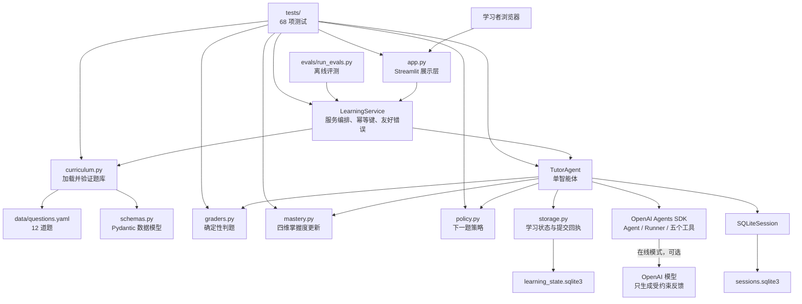

# v0.1 MVP 技术总结 + v0.2 演进路线

## 文档信息

| 项目 | 内容 |
| --- | --- |
| 项目名称 | 概率统计 × Python 数据分析学习诊断智能体 |
| 当前版本 | v0.1 MVP |
| Git 基线 | `47f280d`，标签 `v0.1-mvp` |
| 基线状态 | 检查开始时 `HEAD`、`master` 与 `v0.1-mvp` 指向同一提交，工作区干净 |
| 自动化检查 | Windows、Python 3.13.5、pytest 9.0.2；收集 68 项，68 passed |
| 代码检查 | 虚拟环境执行 Ruff，All checks passed |
| 人工验收 | 完整学习流程通过；报告中的具体日期和测试环境仍为“待确认” |
| 文档用途 | 项目答辩、教师评审、v0.2 规划和开发交接 |

## 答辩速览

| 问题 | 一句话结论 |
| --- | --- |
| 项目解决什么问题 | 诊断初学者在统计概念、数学计算、Python 实现和数据解释四个维度上的具体困难 |
| v0.1 做到了什么 | 形成“题目—确定性判题—诊断—掌握度—持久化—下一题”的离线可运行闭环 |
| 工程基线 | Git 标签 `v0.1-mvp`；pytest 收集 68 项并全部通过；人工完整学习流程通过 |
| 核心设计 | 分数和推荐由确定性程序计算，LLM 只用于可选教学表达；返回报告的事实字段由代码锁定 |
| 三项主要优势 | 无 API Key 可运行、四维诊断、SQLite 持久化和正常重复提交幂等 |
| 三项主要风险 | 在线 Agent 工具副作用未完全隔离、mastery 未经教育测量验证、题库与评测集较小 |
| v0.2 主线 | RAG 课程依据、BKT 实验模型、更加严格的智能体评测 |

## 当前待确认事项

| 待确认信息 | 当前状态 |
| --- | --- |
| 人工测试日期和具体环境 | `docs/manual_test_report.md` 尚未填写 |
| 真实 OpenAI API 端到端行为 | 自动化测试只覆盖离线模式 |
| 在线 Agent 工具调用是否可能产生额外状态写入 | 代码存在该可能性，尚无在线副作用测试 |
| Agents SDK 在线会话实际持久化的完整字段 | 需要针对当前 SDK 版本检查 SQLite 内容 |
| 在线模型延迟、token 和成本 | 当前离线评测不能回答 |
| RAG 资料来源、授权和检索阈值 | v0.2 设计阶段待确定 |
| BKT 参数及其教育测量有效性 | 尚无真实学习数据校准 |
| 对真实学习效果的影响 | 尚未进行真实学习者实验 |

本文严格区分三类表述：

- **已实现**：能够在当前仓库代码、测试或验收记录中找到依据；
- **当前局限**：代码检查或评测结果揭示的边界；
- **建议/未来计划**：v0.2 的设计方向，本任务没有实现这些功能。

## 目录

1. [项目摘要](#一项目摘要)
2. [v0.1 产品范围](#二v01-产品范围)
3. [v0.1 技术架构](#三v01-技术架构)
4. [一次完整请求流程](#四一次完整请求流程)
5. [四维能力画像](#五四维能力画像)
6. [题库与教学策略](#六题库与教学策略)
7. [测试和验收结果](#七测试和验收结果)
8. [v0.1 的优势](#八v01-的优势)
9. [v0.1 的局限和风险](#九v01-的局限和风险)
10. [v0.2 产品目标](#十v02-产品目标)
11. [v0.2 技术演进路线](#十一v02-技术演进路线)
12. [v0.2 里程碑](#十二v02-里程碑)
13. [推荐目录变化](#十三推荐目录变化)
14. [研究和大创价值](#十四研究和大创价值)
15. [下一步执行建议](#十五下一步执行建议)

# 一、项目摘要

## 1.1 项目要解决的问题

本项目面向同时学习概率统计和 Python 数据分析的初学者。传统练习系统通常只判断答案
“对或错”，但学习者的困难可能来自四个不同位置：

- 不理解统计概念；
- 公式选择或计算过程错误；
- 不理解 Python/NumPy/Pandas 的实现；
- 数值算对了，但对数据结论的解释错误。

项目因此不只返回正确性，还尝试根据可观察作答证据形成四维诊断，给出渐进提示，并推荐
下一道适合当前状态的题。

## 1.2 目标学习者

- Python、概率统计和大模型应用开发初学者；
- 能阅读基础 Python，但尚不熟悉 NumPy、Pandas 和统计推断；
- 需要简体中文反馈、可复制的运行命令和清晰错误说明；
- 不要求具备高级数学证明、前端工程或多智能体开发经验。

## 1.3 跨学科特点

“概率统计 × Python 数据分析”不是把两门课简单并排放置。当前题库让同一知识点同时关联：

| 学习层面 | 示例 |
| --- | --- |
| 统计概念 | 区分标准差与标准误 |
| 数学计算 | 计算样本标准差、标准误或置信区间端点 |
| Python 实现 | 理解 `Series.std()`、`median()`、`np.sqrt()` 和 `ddof=1` |
| 数据解释 | 判断异常值、区间估计或样本量对结论的影响 |

题目的 `dimension_weights` 会把同一次作答映射到不同能力维度，使“会算但不会解释”这类
跨学科断点能够被单独观察。

## 1.4 为什么采用智能体

普通答题系统可以完成固定题目的判分，但当前项目还需要组织题目、判题工具、学习状态、
推荐策略、会话历史和结构化教学反馈。单个 `TutorAgent` 通过 OpenAI Agents SDK 把这些
能力组合成一个教学角色，并为在线模式提供自然语言反馈。

采用智能体不代表把正确性判断交给大模型。当前设计的关键是：

- 确定性程序负责分数、误区候选、掌握度和下一题；
- 智能体负责基于这些事实组织教学反馈；
- 在线模型返回后，代码会用确定性报告覆盖分数、证据、误区标签和下一题等返回字段。

这一锁定能够保护返回给页面的 `DiagnosticReport`，但不能等同于“在线模型完全无法影响
持久化状态”。当前 Agent 仍持有判题和更新状态工具；如果模型用不同的 `submission`
重新调用工具，理论上可能触发额外状态写入。现有测试没有覆盖该在线副作用。因此更准确的
结论是：智能体被设计为受约束的教学解释层，返回报告不能自由改分，但在线工具的写状态
边界仍需在 v0.2 前隔离和测试。

## 1.5 v0.1 已形成的学习闭环

v0.1 已形成以下闭环：

> 选择知识点与题目 → 提交答案/推理/代码文本 → 确定性判题 → 分层提示与诊断 →
> 更新四维掌握度 → SQLite 保存 → 推荐下一题 → 刷新后继续学习

无 `OPENAI_API_KEY` 时，这一闭环仍可运行。人工验收已覆盖题目选择、答案提交、四维诊断、
掌握度更新、提示、下一题和刷新后恢复。

# 二、v0.1 产品范围

## 2.1 已实现功能

| 功能 | 实现依据 |
| --- | --- |
| 简体中文单页学习界面 | `app.py` |
| 学习者 ID 与知识点选择 | `app.py`、`service.py` |
| 12 道 YAML 内置题 | `data/questions.yaml` |
| Pydantic 题库验证与中文错误 | `schemas.py`、`curriculum.py` |
| 数值、选择、关键词辅助和 DataFrame 判题器 | `graders.py` |
| 四维启发式掌握度 | `mastery.py` |
| 前置关系、薄弱维度和难度驱动的推荐 | `policy.py` |
| 单教学智能体与五个工具 | `tutor_agent.py` |
| Pydantic `DiagnosticReport` | `schemas.py` |
| SQLite 学习状态、会话和提交回执 | `storage.py`、`tutor_agent.py` |
| 离线模式 | `config.py`、`tutor_agent.py` |
| 重复提交幂等返回 | `service.py`、`storage.py` |
| 重置演示学习者 | `app.py`、`storage.py` |
| 36 条离线评测案例和六项独立指标 | `evals/` |
| learner code sandbox 威胁模型 | `docs/learner_code_sandbox.md`，仅设计、未实现 |

## 2.2 尚未实现

- RAG（Retrieval-Augmented Generation，检索增强生成）课程知识库；
- BKT（Bayesian Knowledge Tracing，贝叶斯知识追踪）；
- 经过真实学习者实验校准的掌握度模型；
- 真实在线 OpenAI API 的自动端到端测试；
- 教学资料引用、引用忠实度和检索质量评测；
- 生产级监控、成本预算、隐私同意和数据保留策略；
- 安全执行学习者任意 Python 代码；
- 云端账户、多设备同步和生产数据库。

## 2.3 明确不属于 v0.1

- 多智能体、handoff、智能体辩论或智能体路由；
- 任意代码执行、Notebook kernel、在线解释器；
- 自动生成后未经审核直接入库的新题；
- 教师管理后台、班级、排行榜和大规模在线课堂；
- 模型微调；
- 对考试、升学或个人能力作高风险自动决策。

## 2.4 在线模式与离线模式

| 对比项 | 离线模式 | 在线模式 |
| --- | --- | --- |
| 触发条件 | 没有 `OPENAI_API_KEY` | 配置了 `OPENAI_API_KEY` |
| 判题 | 确定性判题器 | 同一确定性判题器 |
| 掌握度与推荐 | 本地纯函数 | 同一纯函数 |
| 教学反馈 | 固定的确定性中文模板 | OpenAI Agents SDK 生成反馈；返回报告中的事实字段随后被锁定 |
| 会话 | 写入 SDK `SQLiteSession` | 使用 SDK `SQLiteSession` |
| API 成本 | 无 | 有，取决于模型与调用量 |
| 当前自动化验证 | 已覆盖 | 真实提供商端到端行为和工具副作用待确认 |

模型名从 `OPENAI_MODEL` 读取，没有在代码中写死。API 失败会被 service 转换成简体中文
错误，但在线失败时的状态事务一致性仍存在风险，见第九章。

## 2.5 知识点和题目范围

当前恰好 12 道题，4 个知识点各 3 道：

| `concept_id` | 中文主题 | 题型 |
| --- | --- | --- |
| `mean_median` | 均值与中位数 | 概念、Python、数据解释 |
| `variance_std` | 方差与标准差 | 概念、Python、数据解释 |
| `sampling_standard_error` | 抽样与标准误 | 概念、Python、数据解释 |
| `confidence_interval` | 置信区间 | 概念、Python、数据解释 |

当前没有独立的 `calculation` 题型；计算能力通过题目的 `calculation` 权重共同观察。

# 三、v0.1 技术架构

## 3.1 当前系统架构图



图中的 `graders`、`mastery`、`policy` 和持久化事实属于确定性路径；LLM 是可选反馈路径。

## 3.2 各模块职责

### Streamlit 展示层：`app.py`

- 三栏展示学习状态、题目输入和诊断报告；
- 管理页面级 `session_state`，处理提示等级和下一题切换；
- 调用 `LearningService`，不包含判题和推荐算法；
- 显示离线模式、API 失败和题目不可用的中文提示；
- Python 代码输入框明确声明“仅作为文本分析，不会执行”。

### service 服务层：`src/probstat_tutor/service.py`

- 加载题库、持久化仓库和 `TutorAgent`；
- 为页面提供 dashboard、选题、取题、提示、提交和重置接口；
- 用输入内容的 SHA-256 生成 `submission_key`；
- 命中提交回执时直接返回已有报告，避免正常连续点击重复更新；
- 把内部异常转换为学习者可理解的中文错误。

### TutorAgent：`src/probstat_tutor/tutor_agent.py`

- 只创建一个 SDK `Agent`，没有 handoff；
- 暴露五个工具：取当前题、判题、读状态、更新状态、选下一题；
- 使用结构化 `DiagnosticReport`；
- 离线时不调用 `Runner.run`；
- 在线返回报告只采用模型的反馈文本和部分不确定性说明，分数等事实字段最终由代码锁定；
- 当前在线 Agent 仍能调用有写入能力的工具，输出字段锁定不代表工具副作用已经隔离。

### curriculum：`src/probstat_tutor/curriculum.py`

- 使用 `yaml.safe_load` 读取 YAML；
- 使用 `QuestionBank` 做 Pydantic 验证；
- 将文件不存在、YAML 损坏、字段错误转换为清晰中文异常；
- 默认路径由 `Settings.questions_path` 提供。

### graders：`src/probstat_tutor/graders.py`

- `grade_numeric`：整数、浮点、百分比、绝对/相对容差；
- `grade_multiple_choice`：大小写和空格标准化；
- `grade_text_keywords`：最高只作为部分证据，永远不声称完全理解；
- `grade_dataframe_result`：比较列名顺序、形状和数值；
- 拒绝 NaN、无穷大和非法容差；
- 不调用模型，也不执行学习者代码。

当前 TutorAgent 的题库提交路径实际使用数值、JSON 列表和标准化选择比较；关键词辅助判题器
已有测试，但尚未接入自由文本综合诊断。

### mastery：`src/probstat_tutor/mastery.py`

- 初始每个“知识点 × 能力维度”为 `0.5`；
- 按提示等级折减证据；
- 使用不可变式纯函数返回新 `LearningState`；
- 正确题加入 `completed_question_ids`；
- 提供知识点平均掌握度和全局最弱维度计算。

### policy：`src/probstat_tutor/policy.py`

- 前置知识平均掌握度阈值为 `0.60`；
- 排除已完成题和最近三次题；
- 优先题目在全局最弱维度上的权重；
- 再选择难度接近当前掌握度的题；
- 连续两次失败降低目标难度 `0.15` 并建议一级提示；
- 连续两次成功提高目标难度 `0.15`；
- 返回 `question`、`blocked` 或 `complete` 明确状态。

### storage 与 SQLite：`src/probstat_tutor/storage.py`

- `learner_states` 表保存 Pydantic `LearningState` JSON；
- `submission_receipts` 表用 `(learner_id, submission_key)` 做唯一键；
- SQLite 连接在成功时提交、异常时回滚并始终关闭；
- `reset` 只删除指定学习者的状态和回执；
- Agents SDK 会话另存于 `sessions.sqlite3`，与学习状态库分离。

需要进一步区分两类数据库内容：

- `learner_states` 保存掌握度、尝试元数据和已完成题目 ID，本身不保存完整的答案、
  思考过程或代码文本；
- `submission_receipts` 保存 `DiagnosticReport`，其中的 evidence 可能包含答案、思考过程
  和代码文本的最多 500 字符摘录；
- 离线 `SQLiteSession` 会保存原始 `submission` 和确定性报告；在线会话由 Agents SDK
  管理，实际保存的完整工具调用和请求字段仍需针对当前 SDK 版本确认。

### schemas：`src/probstat_tutor/schemas.py`

集中定义 `Question`、`QuestionBank`、`GradeResult`、`LearningState`、
`NextQuestionDecision` 和 `DiagnosticReport` 等契约。`extra="forbid"` 防止未声明字段被悄悄
接受，数值范围和题库整体约束在加载时验证。

### evals：`evals/`

- `cases.jsonl`：36 条人工标注案例，覆盖 10 类回答；
- `run_evals.py`：强制离线运行，逐项输出六个指标，不合并成模糊总分；
- `tests/test_evals.py`：验证案例数量、类别、ID 和指标结构。

### OpenAI Agents SDK 的作用

SDK 当前负责单 Agent 定义、工具暴露、结构化输出、`Runner` 在线执行和 `SQLiteSession`
会话保存。SDK 不负责数值判题、掌握度公式或选题排序。这个边界保证模型不可用时核心功能
仍能运行。

# 四、一次完整请求流程

## 4.1 真实代码时序

当前代码的实际执行顺序是：

1. `app.py` 收集答案、思考过程、Python 代码文本和提示等级；
2. `LearningService.submit()` 计算提交幂等键，先查询已有回执；
3. 未命中回执时创建 `TutorContext`；
4. `grade_submission()` 只根据 `answer` 和题目标准答案进行确定性判题；
5. `update_learner_state()` 应用掌握度公式并立即保存 SQLite；
6. `select_next_question()` 根据最新持久化状态选题；
7. 构造确定性 `DiagnosticReport`；
8. 离线模式直接返回；在线模式再调用 SDK `Runner` 生成语言反馈；
9. 在线结果经过 `_lock_deterministic_fields()`，防止模型改变事实；
10. service 保存提交回执，页面展示报告。

因此，从教学概念上可以说“智能体生成反馈后再展示掌握度”，但从代码执行时间看，掌握度
更新和下一题推荐先于在线模型反馈。文档按真实时序记录这一点。

## 4.2 八个教学步骤的责任划分

| 教学步骤 | 责任模块 | 确定性程序 / LLM |
| --- | --- | --- |
| 1. 页面接收输入 | `app.py` | 确定性 UI |
| 2. service 组织请求 | `service.py` | 确定性编排与幂等检查 |
| 3. 确定性判题 | `graders.py`、`tutor_agent.py` | 确定性程序 |
| 4. 智能体生成教学反馈 | `TutorAgent`、Agents SDK | 离线为固定模板；在线可由 LLM 改写 |
| 5. 更新四维掌握度 | `mastery.py` | 确定性纯函数，实际发生在在线反馈前 |
| 6. 保存学习记录 | `storage.py` | SQLite 确定性持久化 |
| 7. 推荐下一题 | `policy.py` | 确定性纯函数，实际发生在在线反馈前 |
| 8. 页面展示结果 | `app.py` | 确定性展示 |

## 4.3 为什么不允许大模型擅自修改分数

- 相同答案应得到相同分数，便于测试和复现；
- 大模型语言输出具有随机性，不适合作为数值评分真值；
- 掌握度和下一题依赖分数，错误改分会产生连锁影响；
- 离线模式必须与在线模式保持核心行为一致；
- 教学诊断必须能追溯到具体答案和判题证据。

代码目前通过三层机制保护返回报告：工具不允许直接传入自定义分数、提示词明确禁止改分、
在线模型输出后再次用确定性报告覆盖事实字段。这些机制能够锁定本次返回结果，但不能证明
在线工具调用没有持久化副作用。正式启用在线模式前，还需要禁止模型替换原始
`submission`，或把写状态工具移出模型可调用范围，并补充相应测试。

# 五、四维能力画像

## 5.1 四个维度

| 维度 | 含义 | 当前可观察证据 |
| --- | --- | --- |
| `concept` | 概念、术语、适用条件和概念区别 | 选项/数值答案、题目 `concept` 权重、误区候选 |
| `calculation` | 公式选择、代入和数值计算 | 数值误差、列表端点、题目 `calculation` 权重 |
| `python` | 对 NumPy/Pandas 代码和参数的理解 | Python 题的数值输出；代码文本目前只作为报告证据，不执行、不直接判分 |
| `interpretation` | 把结果放回数据情境中解释 | 解释题的标准化答案和 `interpretation` 权重；推理文本目前不参与确定性正确性 |

这里要特别区分“记录为证据”和“参与判分”。`reasoning` 与 `python_code` 会进入诊断报告，
但当前确定性正确性主要由 `answer` 决定。

## 5.2 当前更新公式

对某道题、某一能力维度，代码先计算：

```text
adjusted_evidence = grade.score × hint_confidence[hint_level]
weighted_evidence = old + dimension_weight × (adjusted_evidence - old)
new = clip(0.7 × old + 0.3 × weighted_evidence, 0, 1)
```

等价形式为：

```text
new = clip(old + 0.3 × dimension_weight × (adjusted_evidence - old), 0, 1)
```

所以题目在某维度权重越高，该维度变化越明显；权重为 0 时该维度不变。只有权重为 1 时，
公式才退化为直接的 `0.7 × old + 0.3 × adjusted_evidence`。

## 5.3 提示等级的证据权重

| `hint_level` | 含义 | 置信系数 |
| ---: | --- | ---: |
| 0 | 未使用提示 | 1.00 |
| 1 | 概念提示 | 0.90 |
| 2 | 方法提示 | 0.75 |
| 3 | 步骤提示 | 0.60 |

提示不会把正确答案直接改成错误，但会降低“独立掌握”的证据强度。

## 5.4 当前启发式模型的优点

- 公式简单，初学者能够读懂；
- 每次更新可重复、可测试；
- 题目权重让一题可以观察多个维度；
- 提示使用被纳入证据；
- 单次作答不会让掌握度从最低瞬间跳到最高；
- 不依赖模型或网络。

## 5.5 当前启发式模型的局限

- 初始值 `0.5` 和更新系数不是由真实学习数据估计；
- 没有显式建模“猜对”“会但失误”和学习迁移；
- 不记录证据数量、置信区间或参数不确定性；
- 连续成功/失败是全局最近两次，不是按知识点或维度校准；
- 对答题间隔、遗忘、题目区分度和学习者差异没有建模；
- 推理与代码文本尚未进入确定性四维评分。

因此，mastery 数值只能解释为“v0.1 题库和当前规则下的启发式状态”，不能解释为经过
教育测量验证的真实能力概率、考试分数或能力认证。

# 六、题库与教学策略

## 6.1 题库结构

`Question` 的真实字段为：

```text
id, title, concept_id, prerequisites, difficulty, question_type,
prompt, dataset, expected_answer, numeric_tolerance, rubric,
misconception_tags, dimension_weights
```

当前 YAML 的 `schema_version` 为 1。Pydantic 会拒绝额外字段。

## 6.2 题型、难度和前置关系

- 题型只有 `concept`、`python`、`interpretation` 三种；
- 每个知识点正好各有一道上述题型；
- 当前难度实际范围为 `0.20` 至 `0.70`；
- 前置链为：

```text
mean_median
  → variance_std
    → sampling_standard_error
      → confidence_interval
```

`mean_median` 没有前置知识；其余主题的三道题使用相同的主题级前置关系。

## 6.3 rubric、误区标签和维度权重

- `rubric`：用中文列出正确回答应体现的关键点；
- `misconception_tags`：列出这道题可能对应的常见误区；
- `dimension_weights`：四维权重之和必须为 1。

当前实现边界：

- `rubric` 已被 schema 验证，但尚未被综合评分器逐条执行；
- 错误答案会返回该题全部 `misconception_tags`，尚未根据答案证据选择最匹配标签；
- 这也是当前离线误区标签准确率只有 72.22% 的主要改进方向之一。

## 6.4 分层提示策略

当前 UI 从无提示状态开始，最多依次请求三级：

1. 概念提示；
2. 方法提示；
3. 第一步/中间步骤提示。

提示由 `LearningService.get_hint()` 统一生成，不包含在每道 YAML 题中，也不直接给最终答案。
早期 `product_spec.md` 设想了逐题四层提示并在最后提供完整解释；当前代码并未实现逐题提示
字段或单独的第四级完整解释。v0.1 已验收的是现有三级渐进提示功能，规格差异需要在后续
版本中明确处理。

## 6.5 连续成功与失败的选题

- 最近两次都失败：目标难度下调 `0.15`，推荐提示等级为 1；
- 最近两次都成功：目标难度上调 `0.15`；
- 其他情况：难度接近当前目标维度掌握度；
- 始终优先题目在全局最弱维度上的权重；
- 排除最近三道题和已正确完成的题；
- 前置知识平均掌握度必须至少为 `0.60`；
- 无候选时返回 `blocked`，全部完成时返回 `complete`。

# 七、测试和验收结果

## 7.1 本次实际检查结果

```text
pytest
collected 68 items
68 passed in 3.20s
```

直接运行 `ruff check .` 时，Windows PowerShell 找不到全局命令。改用项目虚拟环境：

```text
.\.venv\Scripts\python.exe -m ruff check .
All checks passed!
```

这说明 Ruff 已安装在项目虚拟环境中，但没有加入当前 shell 的全局 PATH。

## 7.2 单元测试

| 测试文件 | 数量 | 主要覆盖 |
| --- | ---: | --- |
| `tests/test_curriculum.py` | 7 | 题目数量、ID、难度、权重、题型、前置关系、加载错误 |
| `tests/test_graders.py` | 31 | 数值、百分比、容差、NaN/无穷、选择题、关键词、DataFrame 边界 |
| `tests/test_mastery.py` | 6 | 初始状态、更新公式、提示折减、连续对错、非法提示等级 |
| `tests/test_policy.py` | 8 | 新学习者、薄弱维度、连续对错、前置阈值、最近三题、完成状态 |

小计 52 项，主要验证可重复的纯逻辑和输入边界。

## 7.3 集成与 smoke 测试

| 测试文件 | 数量 | 主要覆盖 |
| --- | ---: | --- |
| `tests/test_service.py` | 5 | 离线闭环、幂等提交、刷新持久化、重置、友好错误 |
| `tests/test_tutor_agent.py` | 8 | 五个工具、无 handoff、模型配置、先判题后更新、离线模式、SDK 会话 |
| `tests/test_app.py` | 1 | Streamlit 页面可渲染、关键按钮存在 |
| `tests/test_evals.py` | 2 | 评测集规模与类别、六个指标分别输出 |

小计 16 项。全部测试均不调用真实 OpenAI API，不产生模型费用。

## 7.4 人工验收

人工完整学习流程已通过，覆盖：

- 加载题目；
- 提交答案；
- 四维诊断；
- 掌握度更新；
- 提示功能；
- 下一题推荐；
- 刷新后学习记录仍存在。

`docs/manual_test_report.md` 已记录这些结果，但其中“日期”和“测试环境”仍为空，应在发布
材料中补齐，当前标记为待确认。

## 7.5 智能体效果评测

本次实际执行 `evals/run_evals.py` 的 36 条离线案例，结果为：

| 指标 | 结果 |
| --- | ---: |
| 确定性判题准确率 | 83.33%（30/36） |
| 误区标签准确率 | 72.22%（26/36） |
| 下一步建议匹配率 | 83.33%（30/36） |
| 一级提示泄露答案比例 | 0.00%（0/3） |
| 平均延迟 | 13.00 ms |
| API 失败比例 | 0.00%（0/36） |

解释边界：

- 这是离线评测，不包含真实模型网络延迟、成本或提供商失败；
- “API 失败比例”当前实际衡量 service 离线调用是否失败；
- 提示泄露指标检查报告中的反馈与建议，不直接检查 UI 的 `get_hint()` 文本；
- 36 条案例与当前题库紧密相关，不能证明对未知回答具备同等效果。

自动化测试通过说明代码在已覆盖场景中行为稳定；它不等于教学效果已经经过科学验证。
真实学习增益仍需要学习者实验和合适的对照设计。

# 八、v0.1 的优势

| 优势 | 仓库依据 | 价值 |
| --- | --- | --- |
| 确定性判题与大模型反馈分离 | `graders.py`、`TutorAgent._lock_deterministic_fields()`；`test_tutor_agent.py` 当前只验证离线路径 | 返回报告的确定性字段有代码级锁定；在线工具副作用测试待补充 |
| 四维能力诊断 | `CapabilityDimension`、`DimensionWeights`、`mastery.py`、`test_mastery.py` | 能区分概念、计算、Python 和解释问题 |
| 离线模式可运行 | `TutorAgent.offline_mode`、`test_service.py`、`test_tutor_agent.py` | 无 API Key 也能演示核心闭环 |
| 结构清晰、覆盖较完整 | UI/service/业务纯函数分层；68 项测试 | 初学者可按模块理解和验证 |
| 学习状态可持久化 | `storage.py`、`test_state_survives_new_service_instance` | 页面刷新或新 service 实例后状态仍在 |
| 正常重复提交幂等 | `submission_receipts`、`test_identical_consecutive_submission_is_written_once` | 连续点击不会正常重复计分 |
| 提示而非立即给答案 | `LearningService.get_hint()`、`_guiding_feedback()`、离线错误反馈测试 | 鼓励学习者继续推理 |
| 题库可验证 | `QuestionBank`、`curriculum.py`、`test_curriculum.py` | 内容错误能在加载阶段暴露 |
| 易于继续扩展 | Pydantic 契约、service 边界、独立 eval runner | 可局部添加 RAG/BKT，而不重写页面 |
| 不执行学习者任意代码 | `app.py` 文案、`tutor_agent.py` 只截取文本、sandbox 文档 | 避免文件、密钥、网络和资源攻击 |

# 九、v0.1 的局限和风险

优先级定义：

- **P0**：阻塞当前使用；
- **P1**：核心正确性、数据一致性或安全风险；
- **P2**：产品体验、诊断可信度或评测不足；
- **P3**：长期工程优化。

## 9.1 风险清单

| 等级 | 局限或风险 | 真实依据 | 建议 |
| --- | --- | --- | --- |
| P0 | 当前未发现已知阻塞项 | 68 项测试和人工闭环均通过 | 保持基线测试，不把“无已知 P0”解释为绝对无缺陷 |
| P1 | 正确答案与错误推理矛盾时，当前判题主要只看 `answer` | `TutorAgent.grade_submission()` 未使用 reasoning/code 判分；离线准确率 83.33% | 增加确定性组合 rubric 与冲突检测 |
| P1 | 错误时返回整题全部误区候选，不是基于回答逐条识别 | `grade_submission()` 直接传入题目 `misconception_tags`；标签准确率 72.22% | 建立证据到标签的规则和人工标注集 |
| P1 | 在线 Agent 可调用判题和写状态工具，返回字段锁定不能阻止所有持久化副作用 | 不同 `submission` 会重置 `state_updated`，之后可再次调用 `update_learner_state()`；当前只有离线测试 | 固定原始 submission，或不向模型暴露写状态工具，并添加模拟在线工具调用测试 |
| P1 | 在线模型失败可能发生在学习状态已经保存、提交回执尚未保存之后 | `diagnose()` 先更新 SQLite，再调用 `Runner.run()`；service 最后才写回执 | v0.2 前先设计事务/状态机，避免重试重复更新 |
| P1 | 状态保存与提交回执不是同一 SQLite 事务 | `save()` 与 `save_submission_report()` 分别提交 | 增加原子提交或可恢复操作日志 |
| P1 | 本地 SQLite/会话包含学习数据，未加密、无用户认证；在线模式会发送必要回答给模型 | `storage.py`、`SQLiteSession`、在线 prompt | 明示数据范围、最小化、保留期、删除和访问控制 |
| P1 | 任意 Python 代码不能直接安全执行 | 当前明确不执行；`learner_code_sandbox.md` 仅设计 | 保持禁用，不得在主进程用 `eval`/`exec`/subprocess |
| P2 | 题库规模小 | 4 个知识点、12 道题 | 扩充但保留原题 ID 与基线 |
| P2 | mastery 是启发式模型 | 固定初值、系数和提示权重，未用学生数据校准 | 以实验模块引入 BKT，并保留默认模型 |
| P2 | 尚未经过真实学生实验 | 仓库只有自动化和人工功能验收 | 设计小规模、知情同意的学习实验 |
| P2 | LLM 教学反馈存在不稳定性 | 在线反馈由模型生成；真实 API 自动化测试缺失 | 增加证据忠实度、幻觉和在线人工评审 |
| P2 | RAG 尚未实现 | 仓库没有知识库、检索或引用模块 | v0.2 建立有来源的检索闭环 |
| P2 | 误区识别评测样本有限 | 36 条案例，且与 12 道题强相关 | 扩充独立开发集、验证集和盲测集 |
| P2 | 当前评测集可能过拟合 | 规则、题库和评测案例在同一仓库共同演进 | 冻结盲测集，记录版本和数据来源 |
| P2 | 一级提示泄露指标没有直接评测 UI 提示 | `_hint_leaks()` 只检查 report feedback/action | 将 `service.get_hint()` 也纳入泄露检测 |
| P2 | 当前提示是通用三级提示，未使用逐题提示内容 | `service.get_hint()`；`Question` 无 hints 字段 | 先定义版本化提示 schema，再做内容评审 |
| P2 | `rubric` 已保存但未逐条用于综合判题 | schema/YAML 有 rubric，提交路径不执行 rubric | 将 rubric 转成可测试的确定性检查 |
| P2 | 模型成本与在线延迟未知 | 当前 eval 强制离线 | 记录 token、模型、缓存、延迟分位数和预算 |
| P2 | README 顶部仍称智能体/页面尚未完整实现 | `README.md` 顶部与后续章节、实际代码不一致 | 后续单独文档任务修正，不与功能开发混做 |
| P3 | 依赖使用范围版本，长期复现可能变化 | `pyproject.toml` 使用最低版本约束 | 发布时记录锁文件或环境快照 |
| P3 | 当前为本地单机 SQLite 和单页 UI | `storage.py`、`app.py` | 只有实际规模需求出现后再演进 |

## 9.2 风险小结

v0.1 的离线 MVP 可用，但“功能能运行”与“诊断科学可信”是两件事。v0.2 应优先提升判题
证据、状态一致性和评测质量，而不是先增加更多界面或复杂智能体。

# 十、v0.2 产品目标

v0.2 的核心目标是：

> **在保持 v0.1 稳定兼容的前提下，提升诊断依据、掌握度估计可信度和智能体评测能力。**

重点包括：

1. 建立带来源引用的 RAG 课程知识库；
2. 以实验方式引入 Bayesian Knowledge Tracing；
3. 扩展智能体评测指标和盲测数据；
4. 扩充题库、误区证据和 rubric；
5. 增加可观察性、隐私说明、失败一致性和成本控制。

v0.2 暂时不做：

- 复杂多智能体；
- 任意学习者代码直接执行；
- 大规模在线课堂；
- 教师管理后台；
- 模型微调；
- 未经验证的自动高风险决策。

# 十一、v0.2 技术演进路线

## 工作流 A：RAG 课程知识库

RAG 是“先检索课程材料，再让模型依据材料回答”。目标不是让模型知道更多，而是让反馈
能够引用可核查来源。

### A.1 资料格式与解析

- 首选 Markdown 和结构化 JSON/YAML，便于版本控制和人工审查；
- PDF/HTML 只在离线解析后转成统一文本，不在每次请求时临时解析；
- 保存原始资料哈希、版本、授权来源和更新时间；
- 数学公式、代码块、表格和标题层级应保留语义；
- 解析失败的文档进入人工复核队列，不能静默进入知识库。

### A.2 切片与元数据

“切片”是把长文档分成可检索的小段。建议每个片段包含：

```text
chunk_id, source_id, source_version, concept_id, dimension,
difficulty, content_type, prerequisite, hint_level_limit,
contains_final_answer, text, checksum
```

切片优先按标题、定义、例题和注意事项等语义边界进行；不要只按固定字符数粗切。

### A.3 向量检索与重排

- 向量检索：把文本转换为向量，按语义相似度找候选片段；
- 关键词检索：保留概念 ID、公式名和 Python API 的精确匹配；
- 混合召回：合并向量与关键词结果；
- 重排：结合当前题目、薄弱维度、提示等级和前置知识重新排序；
- 检索参数和 embedding 模型必须可配置、可记录版本。

### A.4 引用与答案泄露控制

- 每段反馈返回 `chunk_id`、资料标题和可读定位；
- 模型只能引用检索结果中真实存在的来源；
- 第一级/第二级提示过滤 `contains_final_answer=true` 的片段；
- 完整答案片段只有在教学规则允许时才可检索；
- 题目标准答案、隐藏 rubric 和评测标签不能进入普通提示检索索引；
- 输出后做引用存在性和提示泄露检查。

### A.5 无结果时降级

当没有达到最低相关度的结果时：

- 明确说明“未检索到足够可靠的课程依据”；
- 回退到 v0.1 的确定性反馈和通用提示；
- 不让模型凭记忆补写引用；
- 记录无结果事件，但不记录不必要的完整学习者隐私数据。

### A.6 如何证明 RAG 真正改善反馈

至少比较以下系统：

1. v0.1 离线确定性模板；
2. 在线模型但不使用 RAG；
3. 在线模型使用 RAG。

指标包括检索 Recall@k、Precision@k、引用正确率、证据忠实度、幻觉率、提示泄露率、人工
教学质量评分、延迟和成本。只有引用更多并不等于效果更好。

## 工作流 B：Bayesian Knowledge Tracing

BKT 用概率状态描述“学习者是否掌握某项技能”，并根据连续作答更新估计。

### B.1 保留当前启发式模型

- `mastery.py` 继续作为 v0.1 默认实现；
- BKT 放在独立实验模块后面；
- 通过统一 estimator 接口选择 `heuristic` 或 `bkt`；
- 默认开关保持 `heuristic`，出现问题可立即回滚；
- 不直接重写已有 SQLite 状态。

### B.2 BKT 最小参数

| 参数 | 含义 |
| --- | --- |
| `initial_mastery` / `P(L0)` | 第一次作答前已经掌握的概率 |
| `guess` / `P(G)` | 未掌握却猜对的概率 |
| `slip` / `P(S)` | 已掌握却答错的概率 |
| `learn` / `P(T)` | 一次学习机会后从未掌握转为掌握的概率 |

最小更新先根据对错计算后验，再应用学习转移：

```text
correct:
posterior = P(L) × (1-slip)
            / [P(L) × (1-slip) + (1-P(L)) × guess]

wrong:
posterior = P(L) × slip
            / [P(L) × slip + (1-P(L)) × (1-guess)]

next = posterior + (1-posterior) × learn
```

参数必须满足概率范围，并防止分母为零。提示等级可以作为观测条件或不同的 guess/slip
参数，但不能未经验证就把“提示后答对”当作独立掌握。

### B.3 数据结构与迁移

建议每个“知识点 × 能力维度”保存：

```text
model_type, model_version, mastery_probability,
initial_mastery, guess, slip, learn,
observation_count, last_observation_id, updated_at
```

迁移原则：

- 原有 `LearningState` 和历史记录只读保留；
- 首次启用 BKT 时，从历史 attempt 重放生成实验状态；
- 新状态保存独立 schema/version，不覆盖启发式分数；
- 所有迁移可重复运行并校验记录数量；
- 无历史的新学习者使用经过说明的冷启动先验。

冷启动初期可从中性先验开始，但 `guess/slip/learn` 的数值必须标为待校准，不能伪装成研究
结论。数据足够后再按知识点估计参数。

### B.4 与现有接口兼容

统一接口可保持：

```text
estimator.create_initial_state()
estimator.apply_attempt(state, question, grade, hint_level)
estimator.score(concept_id, dimension)
```

对 UI 和 policy 仍返回 `0..1` 的 `MasteryScores`，但同时附带 `model_type`、证据数和不确定性。
推荐器不应依赖 BKT 内部参数。

### B.5 A/B 测试

- 离线：对同一历史序列分别重放启发式和 BKT；
- 指标：下一次作答预测的 log loss、Brier score、校准曲线、推荐合理率；
- 在线试点：在知情同意下随机分组，比较完成率、提示依赖和后测表现；
- 分析时按知识点和初始水平分层，报告样本量和置信区间；
- 不把较高的 mastery 数字本身当作模型更好。

界面文案使用“根据最近 N 次作答估计”“当前证据有限”，不能写成“你有 83% 的真实能力”。

## 工作流 C：智能体评测

### C.1 指标体系

| 指标 | v0.2 定义方向 |
| --- | --- |
| 确定性判题准确率 | 与人工金标准比较，含答案与推理冲突案例 |
| 误区标签准确率 | 按标签 precision、recall、F1，不只做整组完全匹配 |
| 提示答案泄露率 | 分别检查 UI 提示、模型反馈和 RAG 片段 |
| 诊断证据忠实度 | 每个诊断结论是否能指向真实回答或检索来源 |
| 下一题推荐合理率 | 专家或规则金标准判断先修、难度和目标维度是否合理 |
| 幻觉率 | 反馈是否新增不存在的分数、记录、事实或引用 |
| API 失败率 | 真实请求中超时、限流、提供商错误和结构化输出失败 |
| 延迟和成本 | p50/p95 延迟、输入/输出 token、单次和每学习闭环成本 |

每项指标单独报告分子、分母、数据版本和置信区间，不合并成一个模糊总分。

### C.2 离线评测与在线人工评审

- **离线评测**：固定数据、固定配置、可重复，适合回归测试；
- **在线人工评审**：观察真实表达、对话行为和教学可用性，但成本高且涉及隐私；
- 离线集用于开发，盲测集用于发布门槛；
- 在线数据必须知情同意、匿名化，并允许退出和删除；
- 模型版本、提示版本、检索版本和参数必须随评测结果保存。

# 十二、v0.2 里程碑

以下 8 个里程碑可独立验收。任何里程碑失败都应保持 v0.1 默认路径可用。

## 里程碑 1：冻结 v0.1 基线和评测数据

- **目标**：保存可复现的 tag、环境、题库哈希和六项评测基线。
- **学习内容**：Git 基线、数据版本、可复现实验和指标分母。
- **涉及模块**：`evals/`、`docs/`，不改核心业务。
- **最小修改范围**：新增 baseline JSON/Markdown 和评测数据 manifest。
- **新增测试**：基线 schema、案例哈希、指标字段和版本字段。
- **验收标准**：案例数、指标分子/分母和五项比例指标重复运行完全一致；平均延迟只记录、
  不作为确定性回归门槛；v0.1 仍收集 68 项且全部通过。
- **风险**：把机器相关延迟误当成稳定真值。
- **回滚方式**：删除新增 baseline/manifest；tag 和现有案例不变。

## 里程碑 2：扩充 eval 数据集

- **目标**：增加独立表达、边界输入、冲突推理和误区证据。
- **学习内容**：标注规范、类别平衡、开发/验证/盲测划分。
- **涉及模块**：`evals/cases*.jsonl`、`tests/test_evals.py`、评测文档。
- **最小修改范围**：只扩数据和校验，不改变判题器。
- **新增测试**：唯一 ID、类别覆盖、分割无重复、标注一致性。
- **验收标准**：两名评审者独立检查 100% 新案例；每条分歧有解决记录；开发、验证和盲测
  集的案例 ID 与标准化回答均无重复；盲测标签在发布评测前不可用于调规则。
- **风险**：同一作者、同一题目表达导致标注偏差。
- **回滚方式**：保留 v0.1 36 条集，切回旧 manifest。

## 里程碑 3：建立 RAG 离线检索最小闭环

- **目标**：给定题目和薄弱维度，返回可引用的课程片段。
- **学习内容**：解析、切片、embedding、混合检索和重排。
- **涉及模块**：新增 `rag/`、`data/knowledge/` 和检索测试。
- **最小修改范围**：独立检索 API，不接入 TutorAgent。
- **新增测试**：解析稳定、元数据完整、Top-k 相关性、无结果降级。
- **验收标准**：建立至少 20 条人工标注查询；Recall@5 不低于 0.85；返回片段的来源、
  版本和 checksum 完整率为 100%；一级提示查询的标准答案片段泄露为 0。
- **风险**：资料授权、切片失真、向量模型变更。
- **回滚方式**：关闭 RAG 配置；v0.1 service 无任何行为变化。

## 里程碑 4：接入有引用的教学反馈

- **目标**：TutorAgent 可基于检索片段生成带引用反馈。
- **学习内容**：上下文注入、引用约束、结构化输出和防泄露。
- **涉及模块**：`tutor_agent.py`、`service.py`、RAG adapter、schemas。
- **最小修改范围**：只增加可选反馈上下文；分数、mastery、policy 不改。
- **新增测试**：引用存在、无结果回退、一级提示不泄露、确定性字段锁定。
- **验收标准**：关闭 RAG 时 v0.1 的 68 项测试全部通过且确定性字段不变；至少 20 条固定
  RAG 案例中的外部知识引用存在率为 100%；一级提示答案泄露为 0。
- **风险**：伪造引用、提示过长、成本上升。
- **回滚方式**：feature flag 关闭 RAG，使用 v0.1 模板/在线反馈。

## 里程碑 5：建立 RAG 对照评测

- **目标**：证明 RAG 是否改善忠实度，而不是只展示功能。
- **学习内容**：对照实验、检索指标、人工评分和统计不确定性。
- **涉及模块**：`evals/run_rag_evals.py`、RAG cases、baseline 报告。
- **最小修改范围**：只扩评测，不调整生产排序参数。
- **新增测试**：指标分母、引用校验、泄露检测、结果可序列化。
- **验收标准**：在预先冻结的同一批案例上运行 no-RAG 与 RAG；报告每项指标的分子、
  分母、样本量、模型/检索版本和失败案例；重复运行的非时延指标一致；在门槛评审完成前
  RAG 默认保持关闭。
- **风险**：边看盲测结果边调参造成过拟合。
- **回滚方式**：不满足门槛时保持 RAG 默认关闭。

## 里程碑 6：实现 BKT 实验模块

- **目标**：新增可重放的 BKT estimator，不替换默认启发式模型。
- **学习内容**：贝叶斯更新、guess/slip/learn、数值稳定和 schema 迁移。
- **涉及模块**：新增 `bkt.py`、mastery adapter、实验状态 schema。
- **最小修改范围**：独立模块和 feature flag；保留 `mastery.py`。
- **新增测试**：公式、边界参数、连续对错、提示、冷启动、重放幂等。
- **验收标准**：正确、错误、边界参数和非法参数测试全部通过；同一序列重复重放得到相同
  概率；关闭开关时仍使用 heuristic，v0.1 的 68 项测试全部通过。
- **风险**：参数无数据支撑、把概率误解为事实。
- **回滚方式**：切回 `heuristic`，不删除历史记录。

## 里程碑 7：启发式模型与 BKT 对照

- **目标**：比较两种模型对下一次作答和推荐的解释力。
- **学习内容**：校准、Brier score、log loss、A/B 和分层分析。
- **涉及模块**：`evals/`、实验配置和结果文档。
- **最小修改范围**：离线重放优先，不改变默认 UI。
- **新增测试**：序列分割防泄漏、指标计算、模型版本记录。
- **验收标准**：在冻结的序列数据上分别输出 Brier score、log loss、校准结果、样本量、
  置信区间和失败案例；切换默认模型的判定规则在查看盲测结果前写入评测协议。
- **风险**：样本太小无法得出稳定结论。
- **回滚方式**：保持启发式默认，BKT 仅保留实验代码或删除开关。

## 里程碑 8：综合验收和发布 v0.2

- **目标**：完成回归、隐私、成本、人工体验和发布文档。
- **学习内容**：发布工程、风险接受、迁移和回滚演练。
- **涉及模块**：全仓库，但禁止无关重构。
- **最小修改范围**：只修复验收阻塞项并更新版本文档。
- **新增测试**：在线失败一致性、隐私最小化、RAG/BKT 开关组合和迁移。
- **验收标准**：v0.1 仍收集 68 项且全部通过，Ruff 通过，人工验收表中的 7 项功能通过；
  RAG/BKT 达到事先写入 `v0.2_eval_protocol.md` 的门槛；在线失败一致性、数据迁移和关闭
  feature flag 的回滚演练通过。
- **风险**：功能叠加导致默认路径行为变化。
- **回滚方式**：关闭 RAG/BKT 开关并回到 `v0.1-mvp` 已知稳定基线。

# 十三、推荐目录变化

以下只是建议，不在本任务中创建：

```text
probstat-python-tutor/
├── app.py                              # 保留：Streamlit 展示层
├── data/
│   ├── questions.yaml                  # 保留：v0.1 原题与 ID
│   └── knowledge/                      # 新增：RAG 数据
│       ├── sources/                    # 新增：人工审核课程资料
│       ├── chunks.jsonl                # 新增：版本化切片
│       └── manifest.json               # 新增：来源、许可、哈希
├── docs/
│   ├── product_spec.md                 # 保留
│   ├── learner_code_sandbox.md         # 保留
│   ├── manual_test_report.md            # 保留
│   ├── v0.1_mvp_summary_and_v0.2_roadmap.md # 保留：本文
│   └── v0.2_eval_protocol.md            # 新增：实验与标注规范
├── evals/
│   ├── cases.jsonl                     # 保留：v0.1 的 36 条基线
│   ├── run_evals.py                    # 保留并兼容扩展
│   ├── baselines/
│   │   └── v0.1.json                   # 新增：版本化基线
│   ├── rag_cases.jsonl                 # 新增：检索与引用案例
│   └── bkt_sequences.jsonl             # 新增：匿名序列评测
├── src/probstat_tutor/
│   ├── config.py                       # 保留
│   ├── schemas.py                      # 保留，做兼容扩展
│   ├── curriculum.py                   # 保留
│   ├── graders.py                      # 保留
│   ├── mastery.py                      # 保留：默认启发式模型
│   ├── bkt.py                          # 新增：实验 BKT
│   ├── mastery_estimator.py            # 新增：兼容接口/选择器
│   ├── policy.py                       # 保留
│   ├── storage.py                      # 保留，增加版本迁移时小改
│   ├── service.py                      # 保留：编排入口
│   ├── tutor_agent.py                  # 保留：单智能体
│   ├── observability.py                # 新增：脱敏指标、延迟、成本
│   └── rag/                            # 新增：RAG 独立子包
│       ├── schemas.py
│       ├── ingest.py
│       ├── chunking.py
│       ├── retriever.py
│       ├── reranker.py
│       └── citations.py
└── tests/
    ├── test_*.py                       # 保留：v0.1 回归
    ├── test_rag_*.py                   # 新增
    ├── test_bkt.py                     # 新增
    └── test_observability.py           # 新增
```

该结构不移动现有核心模块，不把 RAG、BKT 或 eval 混入 `app.py`，也不要求大规模重构。

# 十四、研究和大创价值

## 14.1 拟研究问题

1. 有引用的 RAG 反馈能否提高诊断证据忠实度并降低幻觉？
2. BKT 相比固定启发式公式，能否更好预测下一次作答并改善推荐合理性？
3. 四维画像能否比单一正确率更准确地区分“会算不会解释”等学习困难？
4. 渐进提示能否在不直接泄露答案的情况下提高后续独立作答表现？

这些问题均为“拟验证”，当前仓库没有真实学生实验支持效果结论。

## 14.2 可验证假设

- H1：RAG 组的引用正确率和证据忠实度高于无 RAG 的在线模型组；
- H2：RAG 不会提高一级提示答案泄露率到不可接受水平；
- H3：校准后的 BKT 在盲测序列上的 Brier score 低于当前启发式模型；
- H4：基于薄弱维度的推荐在专家评审中的合理率高于固定顺序推荐；
- H5：使用渐进提示的学习者，在后续无提示同类题上的表现得到改善。

## 14.3 对照实验

| 实验 | 对照组 | 实验组 |
| --- | --- | --- |
| 反馈依据 | 在线模型无 RAG | 在线模型 + RAG + 引用 |
| 掌握度 | v0.1 启发式 | BKT 实验模型 |
| 推荐策略 | 固定题序或 v0.1 policy | 使用新 mastery 的 policy |
| 提示策略 | 通用提示 | 经审核的逐题分层提示 |

早期先做离线重放与专家盲评；只有通过隐私和伦理审查后，再进行小规模真实学习者试点。

## 14.4 评价指标

- 判题 accuracy；
- 误区标签 precision、recall、F1；
- 检索 Recall@k、引用正确率；
- 诊断证据忠实度和幻觉率；
- 提示泄露率；
- 下一题推荐合理率；
- Brier score、log loss 和校准误差；
- 后测表现、无提示迁移题表现、完成率；
- p50/p95 延迟、token 和成本；
- API/检索/结构化输出失败率。

## 14.5 可能创新点

- 将统计概念、计算、Python 和解释拆成可追溯四维证据；
- 用确定性判题锁定事实，让大模型只承担受约束的教学表达；
- 将 RAG 引用、提示泄露和推荐合理性放入同一可重复评测框架；
- 对启发式 mastery 与 BKT 做兼容、可回滚的实证比较；
- 离线核心流程使无模型条件下仍可教学和评测。

这些是系统设计上的拟创新点，不等于已经证明提高学习成绩。

## 14.6 需要采集的数据

在知情同意和最小化原则下，可采集：

- 匿名学习者 ID；
- 题目/版本、答案、提示等级、尝试序列；
- 确定性判题证据和误区人工标签；
- 作答耗时、是否重试、下一题接受情况；
- 前测、后测和迁移题结果；
- 对反馈有用性、清晰度的人工评分；
- 模型/提示/检索版本、延迟、token 和失败类型。

不应默认采集姓名、学号、邮箱、学校、精确位置、API Key 或与研究无关的个人信息。

## 14.7 伦理和隐私

- 明确告知哪些回答会发送给外部模型；
- 提供退出、删除和数据保留期限；
- 研究数据与真实身份分离，发布时去标识化；
- 不用 mastery 做考试、升学或惩罚性决策；
- 报告样本量、失访、偏差和不确定性；
- 学习者代码继续只作为文本，除非未来独立安全评审批准隔离 runner；
- 日志不得保存密钥、完整环境或不必要的原始回答。

# 十五、下一步执行建议

## 15.1 接下来最先做的一件事

先完成“v0.1 评测基线冻结”，不要立刻接入 RAG 或 BKT。原因是后续只有与稳定基线比较，
才能判断新功能究竟改善了什么、又破坏了什么。

## 15.2 第一阶段预计修改的文件

以下是未来第一阶段建议，当前尚未修改：

- 新增 `evals/baselines/v0.1.json`；
- 新增 `evals/manifest.json`；
- 新增 `docs/v0.2_eval_protocol.md`；
- 最小扩展 `evals/run_evals.py`，支持机器可读 JSON 输出；
- 最小扩展 `tests/test_evals.py`，验证版本、哈希和基线 schema。

第一阶段不应修改 `app.py`、题库答案、mastery 公式、policy 或 TutorAgent 行为。

## 15.3 第一阶段验收命令

```powershell
.\.venv\Scripts\python.exe -m pytest
.\.venv\Scripts\python.exe -m ruff check .
.\.venv\Scripts\python.exe evals\run_evals.py
git diff --check
```

还应比较新生成的 baseline 与 `v0.1-mvp`：案例数、指标字段、题库哈希和模型模式必须明确。

## 15.4 必须保持不变的 v0.1 行为

- 原 12 道题的 ID、答案和确定性判题行为；
- 无 API Key 时完整离线闭环；
- 模型输出不能覆盖返回报告中的分数、证据、误区候选和下一题；正式启用在线模式前还必须
  隔离 Agent 写状态工具的副作用；
- 单智能体、无 handoff；
- 学习状态刷新后恢复；
- 正常相同提交不重复更新；
- 前置阈值、最近三题和连续对错策略，除非单独版本化；
- Python 代码只作为文本，不在应用主进程执行；
- `OPENAI_MODEL` 通过环境变量配置；
- v0.1 的 68 项回归测试继续通过。

## 15.5 进入 v0.2 前检查清单

- [ ] `v0.1-mvp` 标签和提交哈希已记录且不修改；
- [ ] `git status` 干净；
- [ ] 68 项 pytest 全通过；
- [ ] Ruff 全通过；
- [ ] 人工报告补齐日期和测试环境；
- [ ] 36 条评测数据完成版本和哈希冻结；
- [ ] 离线六项指标保存为机器可读基线；
- [ ] 明确开发集、验证集和盲测集；
- [ ] 阻止在线 Agent 用不同 submission 再次判题和写入学习状态，并增加模拟在线测试；
- [ ] 先处理在线 API 失败后的状态/回执一致性设计；
- [ ] RAG 资料来源、授权和答案泄露规则已评审；
- [ ] BKT 参数和实验表述明确标为待校准；
- [ ] 隐私告知、删除和日志最小化方案已设计；
- [ ] 所有新能力都有 feature flag 和回滚路径；
- [ ] 不引入多智能体或任意代码执行；
- [ ] 发布标准明确区分工程通过与教学效果验证。

## 结论

v0.1 已经证明了一个可本地运行、可离线演示、可测试的单智能体学习闭环。其最重要的工程
基础不是模型调用，而是确定性判题、四维状态、SQLite 持久化、下一题策略和事实字段锁定。

v0.2 应围绕“证据更可靠、估计更可信、评测更严格”演进。先冻结基线，再分别建设 RAG、
BKT 和智能体评测；每一步都保持 v0.1 默认路径可用，并用数据决定是否扩大范围。
